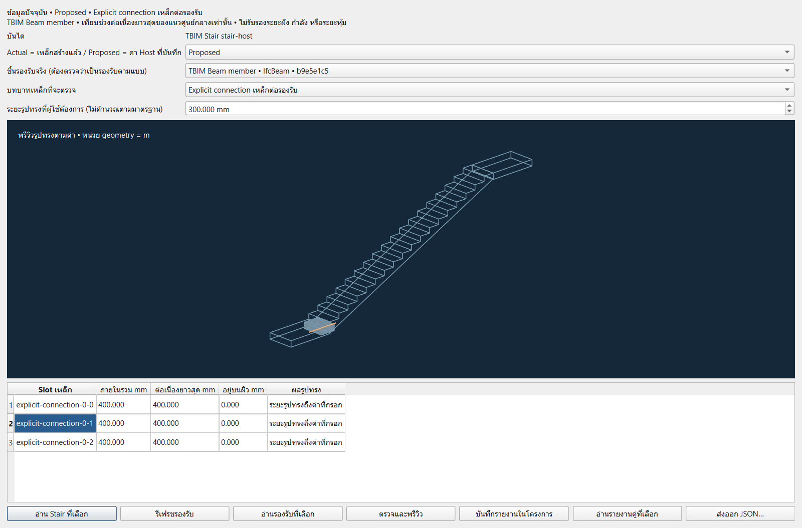
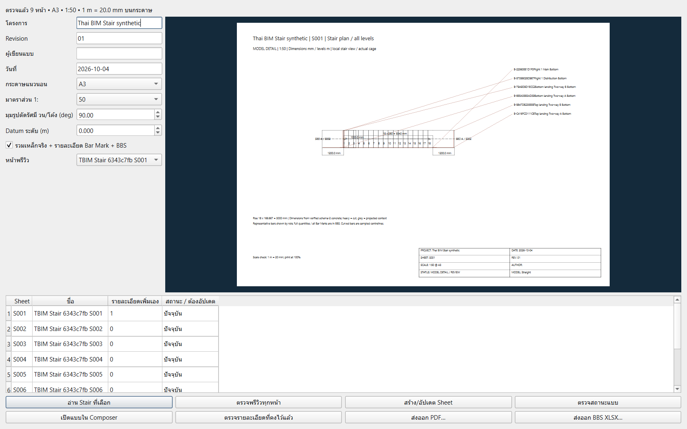
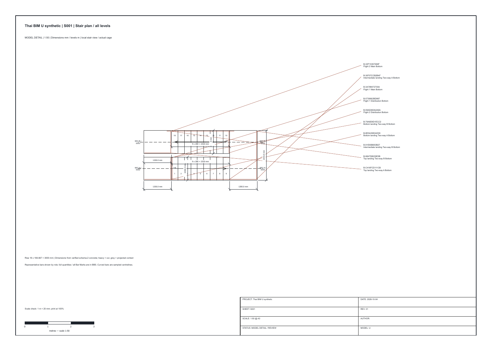
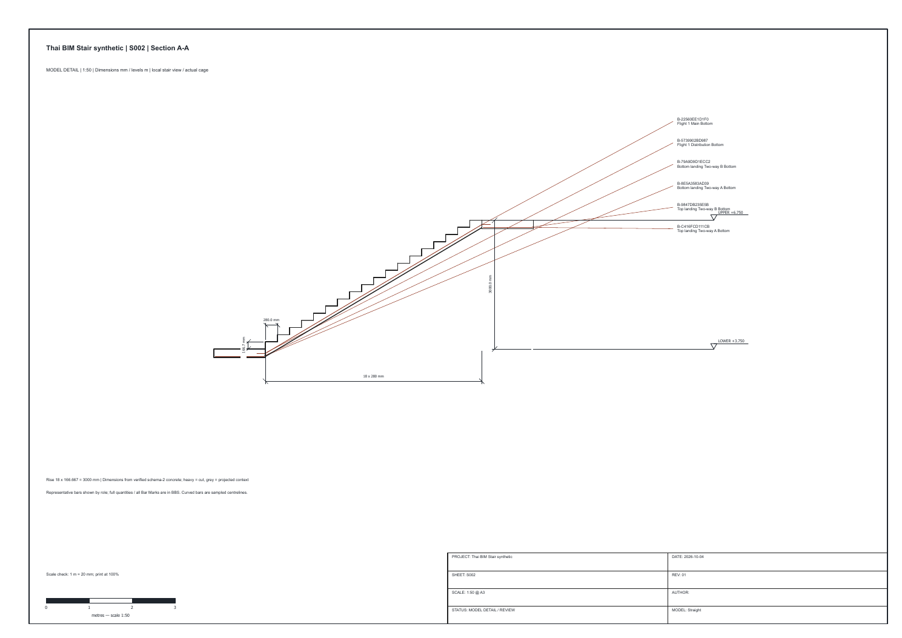
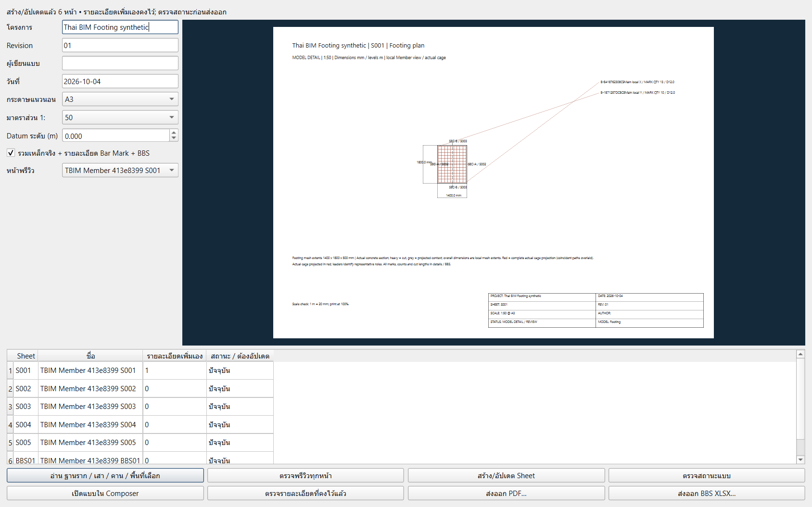
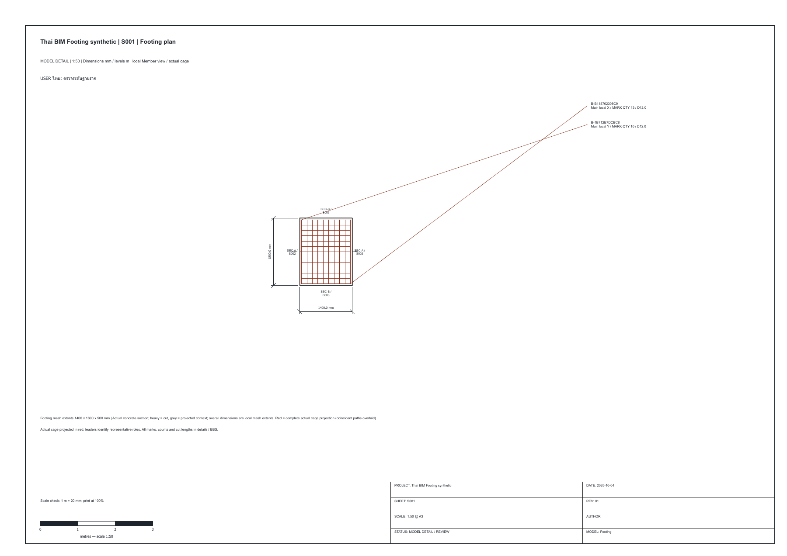
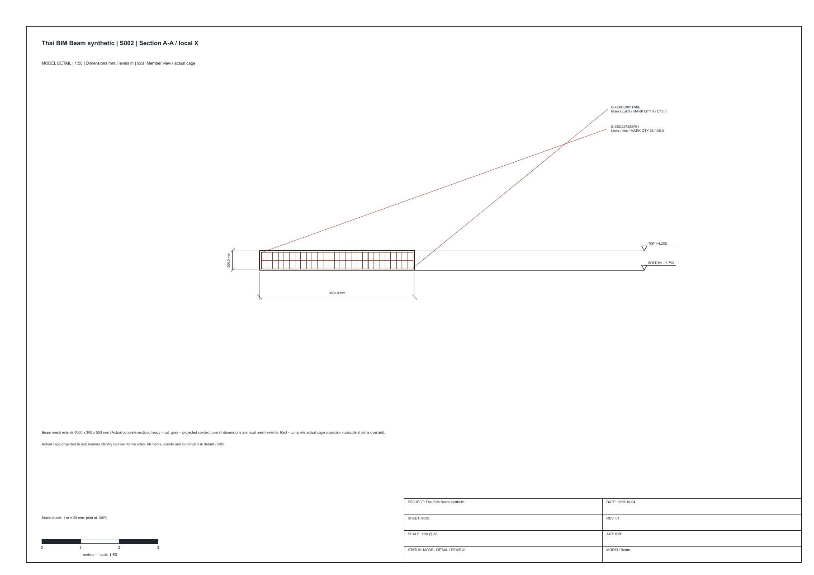
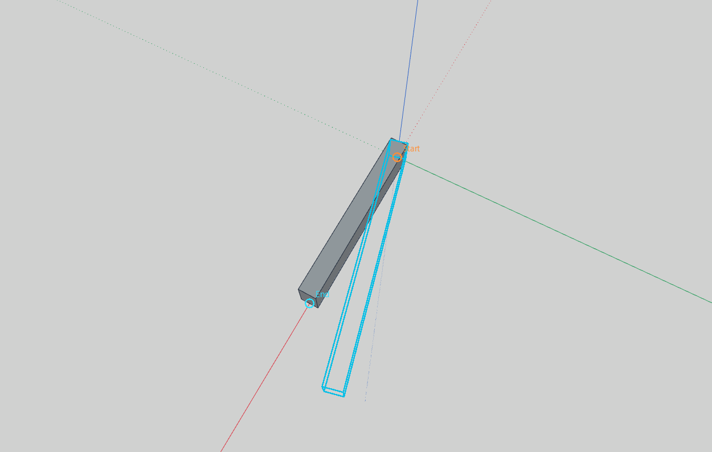
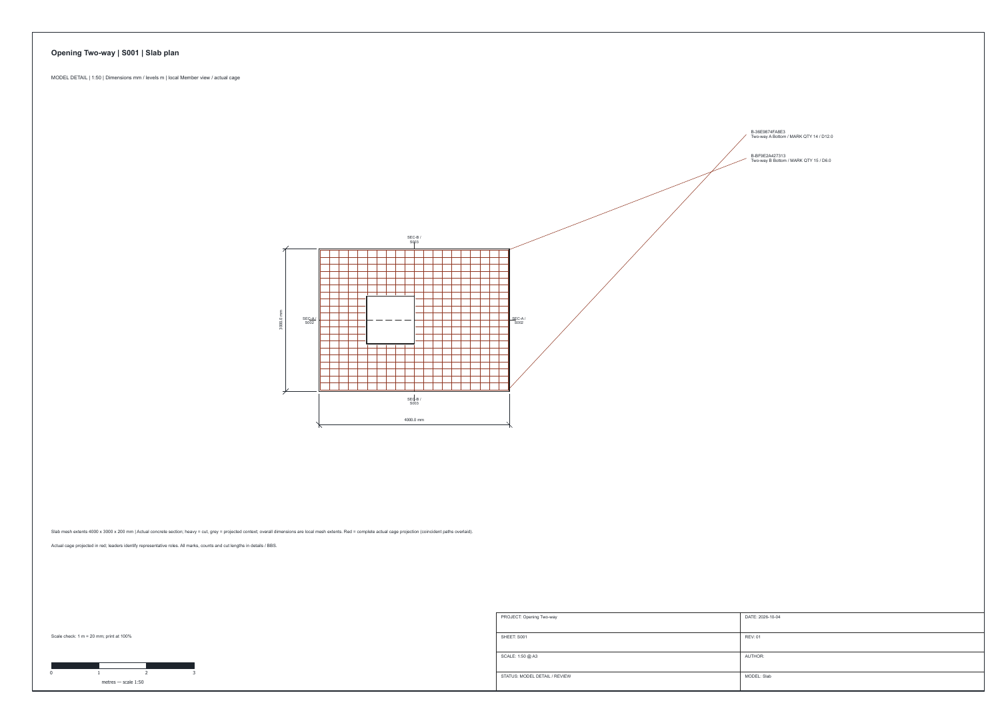

# Thai BIM Toolkit 0.21.0

Extension สำหรับ IngeTrazo Extension API 2 พัฒนาจากงาน Family10
ใช้ Python/PySide6 และไลบรารีของ IngeTrazo ไม่มี API key และไม่มีการเรียก AI ในคำสั่งรุ่นนี้

## ติดตั้งและเปิด

นำโฟลเดอร์ `thai_bim` ซึ่งมี `__init__.py`, `engine.py`, `visuals.py`, `structures.py`, `builders.py`, `detailing.py`, `placement.py`, `workflow.py`, `steel.py`, `management.py`, `audit.py`, `drawing_layout.py`, `drawings.py`, `catalogue.py`, `path_geometry.py`, `type_ui.py`, `multi_place.py`, `identity_data.py`, `copy_identity.py`, `rebar_recipe.py`, `analytical.py`, `analytical_ui.py`, `selected_edit.py`, `selected_geometry.py`, `slab_rebar.py`, `slab_ui.py`, `stairs.py`, `stairs_ui.py`, `stair_catalogue.py`, `stair_library_ui.py`, `stair_placement.py`, `stair_place_ui.py`, `stair_connections.py`, `stair_connection_ui.py`, `stair_drawing_geometry.py`, `stair_drawings.py`, `member_drawing_geometry.py`, `member_drawings.py`, `shape_geometry.py`, `shape_edit.py` ไปไว้ใน
`%APPDATA%\ingetrazo\plugins\thai_bim` แล้วเปิด IngeTrazo ใหม่
เปิดเครื่องมือจากแถบไอคอน Thai BIM หรือ Extensions → Thai BIM Toolkit… หรือแท็บ Thai BIM 0.21
การติดตั้งในครั้งนี้จะเปิดแผงให้ใน session ปัจจุบันด้วย จึงไม่จำเป็นต้องปิดไฟล์ที่ยังไม่บันทึก

API ของ IngeTrazo ช่วง 0.x ยังเปลี่ยนได้ โดยเฉพาะการเชื่อมแผง Render ซึ่งใช้รายละเอียดภายใน
ตรวจ `evidence/live-checks.json` ใน ZIP และ `RELEASE.json` สำหรับหลักฐานเวอร์ชันนี้
อย่าใช้ผล syntax check แทนการทดสอบบนแอปจริงหลังอัปเดต IngeTrazo

## ใช้งาน

1. โครงการ: ตั้งชื่อ Grid X/Y เป็นพิกัดเมตรคั่นด้วย comma และ Level เป็น `ชื่อ=ระดับเมตร`
   เช่น `Upper FFL=3.75` และ `Upper structure=3.65` แล้วกดบันทึกค่าประจำโครงการ
   Grid/Level เป็นเส้นอ้างอิงบน viewport ไม่รวมเป็นชิ้นงานใน QTO และใช้เป็น Grid/Level อ้างอิงในชุด Sheet 1:50 ได้
2. โครงสร้าง: สร้าง RC Footing/Column/Beam/Slab จากกล่องพารามิเตอร์
   X/Y/Z เป็นมุมล่างของชิ้น ส่วนกว้าง/ลึก/สูงตามแกน X/Y/Z
   เสาตาม Grid วางกึ่งกลางเสาที่จุดตัด ใช้ Z และขนาดจากช่องของเครื่องมือ
3. เลือกชิ้น RC ที่สร้างด้วยเครื่องมือหนึ่งชิ้น อ่านค่า แล้วอัปเดตเฉพาะชิ้นที่เลือก
   พิกัดที่อ่านเป็นค่าตอนสร้างก่อน Transform; การอัปเดตจะเก็บ Transform เดิมไว้
   พารามิเตอร์จะสร้าง geometry ของชิ้นนั้นใหม่ จึงแทนการแก้ผิวด้วยมือของชิ้นที่เลือก
4. หลังคา: จั่วสันตามแกน Y มุมเป็นองศา ระยะจันทันตามแนวสัน ระยะแปตามแนวลาด
   Z คือระดับหลังคาที่แนวผนัง ไม่ใช่ปลายชายคา; ปลายชายคาลดตามมุมลาด
   สร้าง/อัปเดตจะจัดชุดหลังคาของ Thai BIM หนึ่งชุด กดซ้ำไม่ซ้อน และไม่แตะหลังคา Family10 เดิม
   หากพบชิ้นในชุดที่แก้ geometry/Transform ด้วยมือ จะหยุดเพื่อให้ตรวจทานก่อน
5. QTO / ตรวจ: สรุปหรือส่งออก Excel/CSV จาก Thai BIM และ metadata ของ Family10
   รายงานแยกฐานการวัด; แถว Family10 เป็นข้อมูล metadata เดิม ไม่ได้วัดใหม่หลังแก้ geometry
   ชิ้นที่ไม่มี metadata รองรับไม่ถูกนับ และมีข้อสังเกตใน Issues
6. ตรวจสี: RGB เก็บสี 3 ค่า และแยก opacity; ปุ่มแก้ RGBA รักษาความโปร่งใสและ Undo ได้
   ปุ่มตั้ง Render ใช้ Blender ที่ติดตั้ง ตั้ง EEVEE/Medium/1920/Ground ไม่เริ่มเรนเดอร์เอง

การสร้าง/อัปเดต/แก้สี และการบันทึกโครงการเป็นคำสั่ง Undo ได้
Save ไฟล์ .igz เพื่อเก็บค่าประจำโครงการและพารามิเตอร์

## ปริมาณและข้อจำกัด

- RC: ปริมาตร solid เต็ม ไม่หักจุดซ้อน ไม่รวมเหล็กเสริม และไม่ใช่ผลคำนวณออกแบบ
- จันทัน: C125×50×20×3.2 มม. รวม lip; ถอดเป็นความยาวสุทธิ ไม่สมมติ kg/m
- แป: PROFAST ECO0.7 ตามหน้าตัดผู้ใช้ ฐาน 61 สูง 27 หน้าบน 20 มม. / web 60°
  ความหนา 0.7 มม. รูปพับเรียบ ไม่รวมรัศมีพับ ลอนบน และขอบกระดกที่ไม่มีมิติ
- จันทันอยู่ใต้แป แปอยู่ใต้ผิวหลังคา; ระยะวางเป็นระยะสูงสุด มีแถวสุดท้ายที่สั้นกว่าช่วงมาตรฐานได้
- ระยะแป 0.30 ม. เป็นค่าเริ่มต้น ต้องตรวจตามกระเบื้อง ไม่ใช่ค่าที่ผู้ผลิตยืนยันในเครื่องมือ
- geometry ไม่รวมเหล็กสัน ตะเข้ การยึดต่อ บาก ระยะทาบ เศษตัด หรือสกรู
  แผนตัดสต็อกเป็นรายงานวัสดุแยกจาก geometry ดูรายละเอียดรุ่น 0.2 ด้านล่าง
- รุ่น 0.2 เพิ่มตัวสร้างโครงหลายระนาบจาก polygon เรียบจริง พร้อม clipping ระนาบเว้า
  ไม่สร้างเส้นโครงใหม่ซ้อนกับโครง Family10 เดิมหรือชุดจั่วของเครื่องมือ
- ชิ้นที่แก้ผิวเองจะไม่มีปริมาณ Thai BIM ยืนยันจนกว่าจะสร้างใหม่/ตรวจทาน
  ปริมาตรชิ้น RC ที่ Transform แล้ววัดจาก geometry; ความยาวเหล็กจากแกนที่ Transform
  พื้นที่หลังคาที่ Transform แล้วต้องตรวจใหม่ จึงเว้นปริมาณไว้
- พบ ID ซ้ำจาก Copy จะรายงานและระงับอัปเดตชุด ยังไม่มีปุ่มปรับ ID สำเนาในรุ่นแรก
- ยังไม่อ่าน PDF/OCR อัตโนมัติ ไม่สร้างสถาปัตย์/MEP; Sheet 1:50 เป็นแบบตั้งต้นจากโมเดล
  ไม่รับรอง LOD 350 และไม่แทนการตรวจแบบโดยวิศวกร/สถาปนิก

## การทดสอบ

`tests/test_thai_bim_engine.py`: geometry, volume, profile envelope, bounds, Excel ภาษาไทย/CSV/formula safety

`tests/live_thai_bim.py`: ทำงานใน IngeTrazo โดยใช้ Scene แยกจากโมเดลที่เปิด
ตรวจ native solid, Undo/Redo, selected edit, UID, roof repeat/reconcile, RGB/opacity,
Transform quantities, .igz round trip, .glb export, copied IDs และ geometry ที่แก้ด้วยมือ
อ่าน QTO Family10 จากโมเดลจริงโดยไม่สร้างชิ้นทดสอบลงในไฟล์ของผู้ใช้

## ระยะถัดไป

libraries ของชิ้นงาน, เครื่องมือสถาปัตย์, MEP, construction sheets 1:50,
และ AI อ่านแบบพร้อมหน้าตรวจทาน
แต่ละระยะต้องมีกรณีจริงสำหรับทดสอบและตรวจปริมาณก่อนปล่อยใช้งาน

อ้างอิง API: https://github.com/ingelibre/ingetrazo/blob/main/docs/plugins.md

## เพิ่มในรุ่น 0.2: หลังคาหลายระนาบ

เปิดแท็บหลังคา → หลังคาหลายระนาบ… อ่าน IfcRoof ที่เลือกหรือทั้งโครงการ
หนึ่ง Group ต่อหนึ่งระนาบ ถ้า Group รวมหลายลาดต้องแยกหรือกรอก JSON ของทุกระนาบเอง
รองรับ polygon เว้าที่ไม่ตัดกันเอง ระนาบไม่มีรู และระดับคลาดจากระนาบไม่เกิน 0.2 มม.
ระนาบแบนยังต้องพัฒนาตัวเลือกทิศทาง รองรับเฉพาะหลังคาลาดในรุ่นนี้

เลือกระนาบอ้างอิงใต้แผ่นหรือผิวบน ตั้งระยะจันทัน ระยะแปตามลาด ระยะเริ่ม/จบแป
และระยะ offset ของหน้าตัดจากระนาบ แล้วกดตรวจแผนก่อนสร้าง
ค่าเริ่มต้น offset 0.0895/0.02665 ม. ใช้จัดจันทัน C125 ใต้แป 27 มม. จากระนาบใต้แผ่น
offset แปอ้างอิงแกนเส้นกลางของฐานแผ่นหนา 0.7 มม.; ผิวล่างฐานต่ำกว่าแกนอีก 0.35 มม.
การเลือกผิวบนต้องแก้ offset ให้รวมความหนามุงด้วย ไม่มีการสมมติความหนามุงให้เอง

บันทึกระนาบและระยะในโครงการเพื่อใช้ซ้ำเมื่อ Save .igz
คำสั่งสร้าง/อัปเดตแก้เฉพาะชุด `multi-roof` ของ Thai BIM และ Undo คืนชิ้นที่ถูกแทน/ลบได้
ชิ้นที่แก้ด้วยมือจะหยุดการสร้างใหม่เพื่อให้ตรวจทาน
ตัวสร้างยังไม่รวมเหล็กสัน ตะเข้ ข้อต่อ หรือตรวจการรับแรง

## เพิ่มในรุ่น 0.2: แผนตัดสต็อก

เปิด QTO / ตรวจ → แผนตัดเส้นสต็อก 6 ม.… เลือก Batten หรือ Rafter
เลือกทั้งโครงการหรือเฉพาะชิ้นที่เลือก ตั้งความยาวสต็อก ระยะทาบ และรอยตัด
ค่าทาบเริ่มต้น 0 เป็นค่าอ่านปริมาณก่อนยืนยันรายละเอียด; หากแนวยาวกว่าสต็อกจะมีข้อสังเกตชัดเจน
ค่ารอยตัดเริ่มต้น 0.003 ม. ต้องปรับตามเครื่องตัดที่ใช้

วัดความยาวจริงเทียบกับแกนของชิ้นงานก่อนเข้ารายงาน
ชิ้นที่แก้ด้วยมือหรือแกนกับ geometry ไม่ตรงกันจะไม่ถูกนำไปวางแผนตัด พร้อมแจ้งรายการ
แยกวัสดุแต่ละหน้าตัด ไม่ปะปนแปกับจันทัน
ใช้ Best-fit decreasing ซึ่งเป็น heuristic ไม่รับรองจำนวนเส้นต่ำสุด
แนวเกินสต็อกแบ่งชิ้นและเพิ่ม allowance ทาบ แต่ไม่ได้ระบุตำแหน่งติดตั้งรอยต่อใน 3D

Excel แยก Summary, Cuts, Stock bars, Notes และตรวจสมดุล:
`สุทธิ + ทาบ + รอยตัด + เศษเหลือ = ความยาวสต็อกที่ซื้อ`
เศษเหลือยังเป็นวัสดุที่นำกลับใช้ได้ ไม่ถือเป็นเศษทิ้งทั้งหมดอัตโนมัติ
ก่อนสั่งซื้อ/ติดตั้งต้องยืนยัน gauge, ระยะทาบ, จุดรองรับ และตำแหน่งรอยต่อ
ไฟล์ Family10 ที่แนบเป็น **scenario** ใช้ทาบ 0.15 ม./รอยตัด 3 มม. ซึ่งยังไม่ใช่รายละเอียดที่อนุมัติ

หลักฐานรุ่นนี้อยู่ใน `verification-v02/` และ `RELEASE.json`
ชุดทดสอบเพิ่ม clipping ระนาบเว้า, สมดุลสต็อก, ชิ้นใกล้ 6 ม., ทาบหลายรอย,
การอ่าน geometry Family10 จริง, native solids, persistence, Undo และป้องกันสร้างซ้อน

## เพิ่มในรุ่น 0.3: ไดอะลอกพร้อมภาพประกอบ

หน้าต่างหลักเป็น modeless สามารถกลับไปเลือกชิ้นงานในโมเดลได้โดยไม่ต้องปิดหน้าต่าง
โครงการแสดง Grid/Level ตามค่าร่าง; โครงสร้างแสดงกล่อง RC ตามขนาดและแกนสี X/Y/Z
หลังคาจั่วมีผังจันทัน/แป รูปตัดแสดงมุมลาดและระดับสัน และภาพหน้าตัดวัสดุ
ภาพอัปเดตเมื่อเปลี่ยนค่า; ถ้าค่าไม่ถูกต้องจะแสดงสาเหตุแทนภาพเก่า
ภาพเหล่านี้เป็นภาพอธิบายพารามิเตอร์ ไม่ใช่ภาพเรนเดอร์หรือแบบก่อสร้างมาตราส่วน

หลังคาหลายระนาบแสดงผังจาก vertices ของ IfcRoof ที่อ่านจริงและแกนสมาชิกที่คำนวณ
ข้อมูล JSON อยู่ในแท็บขั้นสูง; เปลี่ยนผิวอ้างอิงบน/ล่างแล้วต้องอ่าน IfcRoof ใหม่
พรีวิวเป็นค่าร่างปัจจุบัน ซึ่งอาจต่างจากระยะของโครงที่ติดตั้งอยู่ในโมเดล
พรีวิวไม่ได้สร้างหรือแก้ชิ้นงาน; กดสร้าง/อัปเดตเพื่อใช้ค่าร่าง

แผนตัดแสดง 6 เส้นตัวอย่างจากผลคำนวณจริง (สองเส้นแรกและสี่เส้นท้ายถ้ามีมากกว่า 6)
สีฟ้าเป็นชิ้นตัด สีส้มเป็นรอยตัด และสีเทาเป็นเศษเหลือ
รอยตัดขยายความกว้างให้เห็น; ความยาวตัวเลขเป็นเมตร; รายการทั้งหมดอยู่ใน Excel
เมื่อแก้ชนิดวัสดุ/ช่วงเลือก/ค่าตัด จะล้างผลเก่าและต้องกดคำนวณใหม่
ช่องระยะเพิ่มความละเอียดเป็น 6 ตำแหน่งทศนิยม

ใช้ Qt/QPainter ที่มากับ IngeTrazo ไม่มีการเรียกบริการ AI และไม่ต้องติดตั้งไลบรารีเพิ่ม
แนวทางไดอะลอก/พรีวิวศึกษาจากตัวอย่างสาธารณะ โดยเขียนภาพและ UI ของ Thai BIM ขึ้นใหม่:
- https://github.com/aashishzharbade-arch/ingetrazo-extensions/tree/main/repository-upload/ingetrazo_kitchen_maker
- https://github.com/ingelibre/ingetrazo/blob/v0.5.7/examples/extensions/windowizer.py

หลักฐาน UI รุ่น 0.3 อยู่ใน `verification-v03/`; คำสั่งทดสอบ native อยู่ใน `tests/live_thai_bim_v03.py`

## ประวัติรุ่น 0.4 (รายละเอียดเหล็กดูรุ่น 0.5 ด้านล่าง): ไอคอน โครงสร้าง หลังคา และเหล็กเสริม

แถบไอคอน 11 ปุ่ม อยู่แถวแยกที่ด้านบนของแอป ลากย้าย/ปล่อยให้ลอยได้
แต่ละปุ่มมี tooltip: โครงการ ฐานราก เสา คาน พื้น บันได เหล็กเสริม หลังคา หลายระนาบ QTO และแผนตัด
หากซ่อนแถบ เปิดจาก Extensions → แสดงแถบไอคอน Thai BIM
ใช้สัญลักษณ์ที่เขียนใหม่ใน Qt; ไม่เรียกบริการ AI และไม่มีรูป/โลโก้จาก extension อื่น

### สร้าง RC ให้สะดวก

ปุ่มฐานราก/เสา/คาน/พื้นจะเปิดหน้าต่างหลัก พร้อมชนิดและขนาดตัวอย่างที่แก้ได้
เป็นค่าเริ่มต้นเพื่อใช้งานเครื่องมือ ไม่ใช่ขนาดที่คำนวณออกแบบแล้ว
คานวิ่งตาม X: กว้าง X = ความยาว, ลึก Y = หน้ากว้าง, สูง Z = ความลึกคาน
เลือก Grid X/Y และ Level แล้วกดใช้จุดวาง; ฐานราก/เสาวางศูนย์กลางที่ Grid ส่วนคาน/พื้นวางมุมฐาน
การตั้งจุดวางไม่สร้างชิ้นงานจนกดสร้าง; Grid/Level อ่านจากช่องโครงการที่กรอกในหน้าต่าง
ใช้ปุ่มอ่าน/อัปเดตเฉพาะชิ้นที่เลือกเหมือนรุ่นก่อน

### หลังคาจั่ว / ปั้นหยา / เพิง

เปิดไอคอนหลังคา เลือก Gable/Hip/Shed ปรับพิกัด ขนาด มุม ชายคา ความหนา และระยะ
แสดงพรีวิว 3D จาก geometry จริงที่กำลังจะสร้าง
รวมผิวหลังคา จันทัน C125×50×20×3.2 แป PROFAST 0.7 และสมาชิกสัน/ตะเข้ที่ขอบร่วมของระนาบ
จั่วมีสันตาม Y; ปั้นหยามุมเท่ากันและสันตามด้านยาว; แปลนสี่เหลี่ยมจัตุรัสเป็นยอดพีระมิด
กดสร้างชุดใหม่จะสร้างชุดอิสระ; เลือกชิ้นในชุด อ่านค่า แล้วอัปเดตเฉพาะชุดนั้น
อัปเดตที่ไม่เลือกชิ้นจะหยุด และไม่สร้างชุดใหม่โดยเงียบ ๆ
หากชิ้นในชุดถูกแก้ผิว/Transform ด้วยมือ จะหยุดเพื่อให้ตรวจทาน
ยังไม่รวมแผ่นต่อ/สกรู/การคำนวณหน้าตัด/ตารางกระเบื้อง/รอยต่อ/ระบบรองรับ
เครื่องมือหลังคาหลายระนาบเดิมยังรองรับการอ่าน IfcRoof จริง

### บันไดคอนกรีต

รุ่นนี้สร้างบันได RC ตรง: ระบุจำนวนลูกตั้ง ความสูงระหว่างชั้น ลูกนอน ความกว้าง และความหนาท้องตั้งฉากแนวลาด
ลูกตั้ง = ความสูง/จำนวน; จำนวนลูกนอน = ลูกตั้ง−1; ชั้นบนเป็นลูกตั้งสุดท้าย
Z เป็นระดับชั้นล่าง; ท้องที่ปลายเริ่มยื่นต่ำกว่า Z จึงต้องจัดรอยต่อกับพื้น/คานรองรับ
แสดงค่าลูกตั้ง ระยะวิ่ง และ 2R+G เป็นข้อมูลรูปทรง ไม่ใช่ผลผ่านมาตรฐาน
ยังไม่มีชานพัก บันได L/U บันไดโค้ง และราวในรุ่นนี้

### เหล็กเสริมผูกกับ Host

1. เลือกคอนกรีต Thai BIM หนึ่งชิ้น เปิดไอคอนเหล็ก และกดอ่าน Host
2. กรอก cover ขนาดเหล็ก ระยะสูงสุด และจำนวนเส้นตามด้าน (หน่วย mm สำหรับเหล็ก)
3. ตรวจพรีวิวที่แสดง outline คอนกรีตและเหล็ก แล้วกดสร้าง/อัปเดต

- ฐานราก/พื้น: ตะแกรงสองทิศล่างหนึ่งชั้น หรือบนล่างสองชั้น; เหล็กไขว้แยกระดับตามขนาดเส้น
- เสา: เหล็กยืนรอบหน้าตัด และปลอกตามระยะสูงสุด
- คาน X: เหล็กตามยาวรอบหน้าตัดและปลอก; ตั้งจำนวนตามด้านให้เหมาะกับรายละเอียดที่ผู้ใช้ต้องการ
- บันไดตรง: เหล็กล่างตามลาดและเหล็กแจกขวางหนึ่งชั้น; ระยะตามลาดไม่เกินค่าที่กรอก

จำนวน/ระยะจัดให้ครอบคลุมช่วงปลายและตรวจไม่ให้เส้นทับกัน; cover วัดถึงผิวเหล็กนอกสุด
การตรวจนี้เป็นเพียงรูปทรง ไม่ตรวจ clear spacing ตามมาตรฐาน ขนาดมวลรวม หรือความสามารถรับแรง
ปลอกเป็นวงปิดมุม miter เชิง geometry ยังไม่มีตะขอ รัศมีดัด ระยะทาบ/ฝังยึด
เส้นหลักเป็นแนวตรงสุทธิ ไม่มีงอปลาย/ต่อทาบ/เสริมพิเศษรอบช่องเปิด
**ปริมาณเหล็กเป็นความยาวแนวแกนโมเดล ไม่ใช่ BBS หรือรายการตัดเหล็กพร้อมผลิต**
QTO แยกขนาดหลัก/ปลอกและระบุฐานการวัด; ยังไม่คิด kg จาก density หรือเพิ่ม allowance อัตโนมัติ

กดสร้างซ้ำบน Host เดิมอัปเดตชุดเดิมและเก็บ UID ของ slot เดิม; ลดจำนวนมีการนำชิ้นส่วนส่วนเกินออกพร้อม Undo
Host ที่ถูกแก้ผิว/Transform ไม่รองรับในรุ่นนี้; ถ้า Host เปลี่ยน/หายไป QTO เหล็กที่เกี่ยวข้องจะแสดงปริมาณไม่ยืนยัน
เปลี่ยนขนาดคอนกรีตแล้วต้องอ่าน Host และอัปเดตเหล็กเอง; ยังไม่มี dependency regeneration อัตโนมัติ
ไม่เพิ่มเหล็กในโมเดล Family10 เดิมระหว่างการทดสอบ/ติดตั้ง

หลักฐานรุ่น 0.4 อยู่ใน `verification-v04/`: native checks, screenshots, IGZ/GLB และ Excel ของโมเดลทดสอบ
ตัวอย่าง Stair Maker ที่ศึกษา: https://github.com/aashishzharbade-arch/ingetrazo-extensions/blob/main/repository-upload/make_stair/make_stair.py

## งานต่อไป

ลำดับที่ควรทำต่อคือรายละเอียดดัดจริง/ตะขอ/ฝังยึด/ทาบและ BBS จากค่าของผู้ออกแบบ
ตามด้วยบันได L/U/ชานพัก เหล็กเสริมพิเศษ พิกัดหมุน/การวางแบบคลิก และ regenerate เมื่อ Host เปลี่ยน
PDF/OCR เครื่องมือสถาปัตย์/MEP และ construction sheets/LOD350 certification ยังไม่อยู่ในรุ่น 0.4

## ประวัติรุ่น 0.5: รูปดัดเหล็กและ BBS

เลือกคอนกรีต Thai BIM หนึ่งชิ้น → ไอคอนเหล็กเสริม → อ่าน Host → ตั้งค่ารายละเอียด → ดูพรีวิว → สร้าง/อัปเดต
รุ่นนี้เพิ่มไอคอน BBS เป็นปุ่มที่ 12; เลือกแถวในตารางเพื่อดูรูปดัดหนึ่งเส้นและความยาวแต่ละขา

- ฐานราก: เหล็กตรง หรือตะขอ L 90° / U 90° สองปลาย โดยขาตะขอเป็นความยาวตรงหลังจุดสัมผัสส่วนโค้ง
- เสา/คาน: ปลอกส่วนโค้งพร้อมขาตะขอ 135° สองปลาย; ขาตรงวัดจากจุดสัมผัสโค้งถึงปลายเหล็ก
- ทาบ: กรอกระยะทาบกลางเสา/คาน สร้างสองเส้นจริง ขยับเส้นบนเข้าหน้าตัด 1.5 เท่าเส้นผ่านศูนย์กลาง
  ค่านี้เป็นการจัดตำแหน่งในโมเดล ไม่ใช่ข้อกำหนดระยะทาบหรือระยะห่างตามมาตรฐาน
  ถ้าไปซ้อนเหล็กหลักข้างเคียงจะไม่สร้าง; ยังไม่มีการตรวจชนเหล็ก/องค์ประกอบทั้งโมเดล
- ฝังยึด: กำหนดความยาวตรงที่ยื่นจากต้น/ปลายเส้นหลัก ออกนอกปลาย Host ไปยังชิ้นข้างเคียง
  เครื่องมือยังไม่ตรวจว่าปลายยื่นฝังอยู่ในคอนกรีตข้างเคียงจริงหรือไม่
- รัศมีที่กรอกเป็นรัศมีด้านใน; รัศมีเส้นกลาง = รัศมีด้านใน + เส้นผ่านศูนย์กลาง/2
  ความยาวตัด = ผลรวมขาตรง tangent + ผลรวมรัศมีเส้นกลาง × มุมดัดเป็นเรเดียน
  Geometry ผิวโค้งใช้เส้นย่อยไม่เกิน 10°; BBS ใช้ความยาวส่วนโค้งจริง ไม่ใช้ผลรวมเส้นย่อย
- น้ำหนักใช้หน้าตัดวงกลม nominal × ความหนาแน่นที่กรอก ค่าเริ่มต้น 7850 kg/m³ เป็นค่าตัวอย่างที่แก้ได้

BBS แยกตาม Host และรูปดัด/ขนาด/รัศมี/ความหนาแน่น มี Mark จากรายละเอียดที่คงที่เมื่อย้ายตำแหน่ง
Excel มี BBS, Bars รายเส้น และ Basis and issues; รีเฟรชหรือส่งออกจะอ่านโมเดลปัจจุบันใหม่
รูปดัดในตารางใช้รหัสภายใน Thai BIM ไม่อ้างว่าเป็นรหัส BS/ACI หรือผ่านการออกแบบ

เหล็กรุ่นก่อน, พื้น, บันได, Host หาย/เปลี่ยน geometry และเหล็กที่แก้ด้วยมือ/Transform จะไม่เข้ารายการ BBS รายละเอียด
ต้องอ่าน Host และสร้างรายละเอียดใหม่สำหรับฐานราก/เสา/คานเดิม ไม่อัปเกรดเหล็กทั้งโครงการอัตโนมัติ
ค่าตะขอ ทาบ ฝังยึด รัศมีและวัสดุให้ใช้ตามแบบของผู้กำหนดรายละเอียด ไม่คำนวณรับแรงให้

ทดสอบ: 22 pure tests และ 34 native checks สำหรับพรีวิว, solids, UID, อัปเดต, Undo,
Host เปลี่ยน, IGZ round trip, GLB, BBS และ Excel; ดู `verification-v05/live-checks.json`
ระยะถัดไปยังเป็น Smart Placement/Host regeneration, พื้นและบันไดรายละเอียด, construction sheets 1:50 และ architecture/MEP/PDF

## เพิ่มในรุ่น 0.6: คลิกวางและตรวจ Host ก่อนอัปเดตเหล็ก

แถบไอคอนมี 14 ปุ่ม เพิ่ม **วาง RC** และ **ตรวจ Host**

### วาง RC ตาม Grid / Level

เปิดวาง RC → เลือก Footing/Column/Beam/Slab → ตั้งขนาด local X/Y/Z และจุดวาง X/Y/Z
ฐานราก/เสาใช้กึ่งกลางฐาน; คาน/พื้นใช้มุมฐาน หมุนรอบ Z ที่จุดวาง
อ่าน Grid/Level จากช่องโครงการ แล้วกดใช้จุดตัดเพื่อคัดลอกค่าพิกัดไปช่องจุดวาง
ระดับ Z ในช่องเป็นค่าที่ใช้จริงเสมอ แม้ dropdown Level ยังไม่ได้กดใช้จุดตัด

- สร้างหนึ่งชิ้นตามพรีวิว หรือเริ่มคลิกวางซ้ำในโมเดล
- เคลื่อนเมาส์เห็นกรอบชิ้นงานและเส้น Grid ชั่วคราวก่อนวาง; Snap จุดตัด Grid ใช้ระยะ 9 logical pixels ตามการซูม
- Snap endpoint / midpoint / intersection / จุด geometry ที่มีชื่อยังมีลำดับเหนือ Grid
  รับเฉพาะ X/Y ของ snap และคง Z ตามระดับที่เลือก จึงไม่ยกชิ้นไปตาม Z ของผิวที่คลิก
- R หมุนเพิ่ม 90°; Shift+R หมุนลด 90°; Esc จบและคืนเครื่องมือก่อนหน้า
- แต่ละคลิกเป็นชิ้นอิสระ UID ใหม่ และหนึ่ง Undo ไม่สร้างรวมหลายชิ้นในคำสั่งเดียว
- อ่านตำแหน่งชิ้น RC ที่เลือก แล้วอัปเดตเฉพาะชิ้นที่อ่านไว้ โดยรักษา UID/วัสดุ/การซ่อน
  ถ้า Host เปลี่ยนหลังอ่าน ต้องอ่านใหม่; การเปลี่ยนชนิด RC ให้สร้างชิ้นใหม่

ชิ้น RC ใหม่มี placement matrix เพื่อให้ Move/Rotate ของ IngeTrazo ย้าย/หมุนโดยไม่แก้ผิวพารามิเตอร์
สำหรับชิ้นรุ่นเก่าที่ไม่มี placement: อ่านชิ้นเดิมในหน้าวาง RC แล้วอัปเดตเฉพาะชิ้นนั้นก่อนใช้ Move/Rotate
ถ้าชิ้นเดิมถูก Move แบบ baked geometry ไปแล้ว จะถูกมองเป็นการแก้ผิวด้วยมือ ต้องตรวจหรือสร้าง Host ใหม่
ไม่มีการดัดแปลงโมเดลเดิมทั้งโครงการอัตโนมัติ

### Host เปลี่ยน → ตรวจ → อัปเดตเหล็ก

ป้ายในหน้าโครงสร้างแจ้งจำนวน Host ที่ต้องตรวจ เปิดตรวจ Host เพื่อดู Current / Review / Blocked
รายการนี้ติดตามการเปลี่ยนขนาด ตำแหน่ง Host และการย้ายเหล็กแยกจาก Host
การตรวจผิวของเหล็กรายเส้นทำเมื่อพรีวิว/สร้าง/QTO/BBS ไม่สแกนทุกผิวทุกครั้งที่เลื่อนเมาส์

เลือก Host → เปิดพรีวิวเหล็ก → ดูจำนวนและความยาวเดิมเทียบใหม่ → กดตรวจพรีวิวและข้อมูล Host ล่าสุด → สร้าง/อัปเดต
หลังแก้ค่า หรือ Host ย้าย/หมุน/เปลี่ยนขนาด จะไม่ใช้พรีวิวเดิมสร้างเหล็ก ต้องกดตรวจใหม่
การตรวจพรีวิวไม่แก้โมเดล การอัปเดตเหล็กเป็นหนึ่ง Undo แยกจากการย้าย/แก้ Host

เหล็กใช้พารามิเตอร์ local ของ Host และ placement เดียวกับ Host; BBS ใช้ความยาวดัดเดิมภายใต้ rigid transform
Host เปลี่ยนแต่ยังไม่อัปเดตเหล็ก จะไม่ส่งเหล็กเก่าเข้า QTO/BBS จนกว่าจะตรวจและสร้างรายละเอียดใหม่
เหล็กเดิมที่ slot ตรงกันรักษา UID; จำนวนที่ลดลงลบเฉพาะเส้นที่ไม่ใช้ และ Undo คืนได้

- รองรับ translate และ rotation แบบ rigid ของ Host รวมถึงการหมุน 3D ในการสร้างเหล็ก
- หน้าวาง RC รองรับชิ้นตั้งตรงและหมุนรอบ Z; Host ที่เอียงใช้หน้าตรวจเหล็กได้ แต่ไม่แก้จุดวางด้วยหน้านี้
- ไม่รองรับ Scale / shear / mirror หรือการแก้ผิว Host ด้วยมือ
- เหล็กที่แก้ผิวหรือย้ายแยกจาก Host จะบล็อกการสร้างทับ ต้องตรวจทานก่อน
- เอกสารที่เปลี่ยนจะยกเลิกคลิกวาง/บังคับอ่าน Host ใหม่
- ไม่ใช่การออกแบบรับแรงหรือการรับรอง LOD350; ข้อต่อและการตรวจชนทั้งโมเดลยังไม่อยู่ในรุ่นนี้

ทดสอบรุ่นนี้: **27 pure tests + 60 native checks** รวม native Qt mouse/key dispatch,
Move/Rotate, Undo/Redo, Grid priority, Host/BBS invalidation, IGZ และ GLB
หลักฐาน `verification-v06/live-checks.json`; ตัวอย่าง `placed-host-rebar.igz`, `.glb`, `placed-host-BBS.xlsx`
สคริปต์ native รุ่น 0.4/0.5 เป็นหลักฐานย้อนหลัง ต้องใช้ร่วมกับปลั๊กอินรุ่นที่ตรงกัน
ระยะถัดไป: เหล็กพื้นและบันไดรายละเอียด/BBS, บันได L/U และชานพัก แล้ว construction sheets 1:50

## เพิ่มในรุ่น 0.7: Layer / ชิ้นงานเดิม / เหล็กเบา / RB DB ASTM

แถบไอคอน 15 ปุ่ม เพิ่ม **Layer / โมเดลเบา**

- ชิ้นใหม่แยก `TBIM S Footing`, `Column`, `Beam`, `Slab`, `Stair`; เหล็กแยก `TBIM S Rebar <ชนิด Host>` และหลังคาแยกตามชนิดชิ้น
- เปิด Layer / โมเดลเบา แล้วกดจัดเลเยอร์ชิ้น Thai BIM เดิม เพื่อจัดชิ้นก่อนหน้า; เก็บ geometry, UID, hidden และ Undo ได้
- การสร้างชิ้นใหม่เพิ่มชิ้น; อัปเดตชิ้นที่เลือกใช้ได้เฉพาะชนิดเดิม ป้องกันฐานรากกลายเป็นเสาโดยไม่ตั้งใจ
- คำสั่งที่เตรียมไว้ก่อนเอกสาร/รายการชิ้นเปลี่ยนจะหยุดก่อนเขียนทับชิ้นอื่น
- เลือก Host แล้วเปลี่ยนโหมดแสดงผลได้ใน Layer dialog; ใช้พารามิเตอร์ชุดเดิม ตรวจ Host แล้วสร้างชุดนั้นใหม่ รหัสเหล็กและ BBS คงเดิมเมื่อเปลี่ยนเฉพาะโหมด
- Lightweight เป็นค่าเริ่มต้นสำหรับชุดใหม่: หน้าตัด 6 ด้าน และโค้งช่วงละไม่เกิน 30°
- Full: 12 ด้าน โค้ง 10°; ใช้เมื่อต้องการผิวละเอียดสำหรับ geometry export/render
- Centreline: เส้นแกน ไม่มีผิว solid; เก็บขนาด ชนิดและความยาวตัดใน metadata ใช้ทำงาน/ถอดปริมาณ ชิ้นนี้ไม่ใช่ solid LOD350 และการส่งออกที่รองรับเฉพาะผิวจะไม่เห็นเส้น
- ทุกโหมดคำนวณ BBS จากความยาว tangent และส่วนโค้งจริง ไม่ใช้ความยาว chord / จำนวนผิวแทน
- ซ่อนเลเยอร์เหล็กก่อนหมุนภาพ; ซ่อนมีผลต่อ picking และ geometry export/render แต่ QTO/BBS ยังนับชิ้นที่ตรวจแล้ว
- บันทึกสำเนา IGZ แบบบีบอัดลดขนาดบนดิสก์ เก็บ native document.json/embedded assets เปิดกลับผ่าน IngeTrazo ได้; การบีบอัดไม่ได้ลด geometry ใน RAM

### ตัวเลือกเหล็ก

เหล็กหลักและปลอกเลือกมาตรฐาน ขนาด และเกรดแยกกันได้

- RB ผิวเรียบ: มอก.20-2559, SR24, ขนาดจาก RB6 ถึง RB34 ตามตารางมาตรฐาน
- DB ข้ออ้อย: มอก.24-2559, SD30/SD40/SD50, DB6 ถึง DB40 ตามตาราง; availability ต้องตรวจผู้ผลิต
- ASTM A615/A615M: #3–#11, #14, #18; มีชุด SI และ inch แยกกัน ไม่สร้าง #12/#13/#15–#17 ด้วยสูตร
- #3–#8 ใช้เบอร์หาร 8 นิ้วได้; #9=1.128, #10=1.270, #11=1.410, #14=1.693 และ #18=2.257 นิ้ว เป็นค่าตาราง
- #18 SI=57.3 mm; inch 2.257×25.4=57.3278 mm เป็นการแปลงหน่วยของชุดนิ้ว ไม่แทนค่ามาตรฐาน SI
- DB และ ASTM เก็บชนิด Deformed เป็นข้อมูล; ไม่สร้างบั้ง/ครีบจริงเพื่อประหยัด geometry
- Custom / unspecified สำหรับขนาดเดิมที่ไม่ได้ระบุชนิด ไม่มีการอนุมาน RB/DB ให้ชิ้นเก่า
- BBS แยกรหัสตามมาตรฐาน ขนาด ผิว และเกรด พร้อมคอลัมน์ข้อมูลเหล่านี้ใน Excel
- น้ำหนักเป็น nominal circular diameter × input density (เริ่มต้น 7850 kg/m³); ไม่ใช่ค่าตารางมวลที่ปัดเศษหรือใบรับรองเหล็กจริง
- รุ่นนี้มี preset ASTM A615/A615M; ยังไม่มี preset A706/A706M, tensile tests หรือ automatic code design

แหล่งอ้างอิงขนาด:
[มอก.20-2559 รวมฉบับแก้ไข](https://www.tisi.go.th/data/standard/fulltext/TIS-20-2559p.pdf),
[มอก.24-2559 รวมฉบับแก้ไข](https://www.tisi.go.th/data/standard/fulltext/TIS-24-2559p.pdf),
[NYSDOT ตารางขนาด US / SI](https://www.dot.ny.gov/divisions/engineering/technical-services/technical-services-repository/alme/pages/850-1b.html),
[CRSI nominal inch diameters](https://www.crsi.org/wp-content/uploads/CRSI_MSP_29th_Ed_Errata-Nov2019.pdf),
[ASTM A615/A615M-26 scope](https://store.astm.org/a0615_a0615m-26.html).

### ผลทดสอบ 0.7

32 pure tests + 58 native checks ผ่านบน Windows IngeTrazo API2 รวมสร้างสมาชิก 5 ชนิดต่อเนื่อง, ป้องกันอัปเดตผิดชนิด/คำสั่งเก่า, layer migration/visibility/Undo, RB DB ASTM dialog, steel mode conversion และ IGZ บีบอัดเปิดกลับ

ชุดทดสอบเสาเดียว 29 เส้น (มีชิ้นคอนกรีตตัวอย่าง 5 ชนิดในไฟล์):

| โหมด | ผิวเหล็ก | IGZ ปกติ bytes | IGZ บีบอัด bytes |
|---|---:|---:|---:|
| Full | 15526 | 21088108 | 756288 |
| Lightweight | 3256 | 4678153 | 152456 |
| Centreline | 0 | 827391 | 32752 |

ความยาวตัด น้ำหนัก Mark และ UID ของชุดเดิมตรงกันทุกโหมด ผลนี้เป็นชุดตัวอย่าง ไม่ใช่ผลวัด FPS หรือการรับประกันโมเดลทั้งบ้านไม่ค้าง

ดูหลักฐานล่าสุด `evidence/live-checks.json`, `evidence/performance-v07.json` และ `RELEASE.json`; ข้อความผลทดสอบรุ่นก่อนหน้าในคู่มือนี้เป็นหลักฐานย้อนหลัง

## เพิ่มใน 0.7.1: ตรวจทั้งโครงการและ Family10 รุ่นเดิม

แถบไอคอน 16 ปุ่ม เพิ่ม **ตรวจทั้งโครงการ / Family10** พร้อมภาพรวม Layer ปริมาณแยกงาน และ Issues เป็นตารางอ่านอย่างเดียว ส่งออก Excel ได้ รายงานเป็น snapshot ตอนเปิดหน้าต่าง เปิดใหม่หลังแก้โมเดล

Layer dialog เพิ่มช่องรวม Family10 รุ่นเดิม โดยจัดตาม IFC class/discipline และอ่าน Host ID ที่บันทึกใน note ของเหล็ก ไม่สร้าง geometry หรือเปลี่ยน metadata ปริมาณ สถานะ visible/locked/hidden เดิมคงอยู่ เลื่อนรายการเลเยอร์ได้เมื่อโมเดลมีหลายหมวด

เหล็ก Family10 รุ่นเดิมจะแสดงจำนวนที่ถูกตัดออกจาก fabrication BBS อย่างชัดเจน ใช้ quantity metadata เดิมใน QTO ต่อไป คำสั่งอัปเดตกรงเหล็กของ Host ยังรองรับเฉพาะ Host ของ Thai BIM ไม่อนุมานตะขอ ระยะทาบ หรือชนิดเหล็กให้ชิ้นเก่า

การทดสอบไฟล์ Family10 R03 จริง:
- 3980 groups ทั้งหมด / 3962 source-tagged elements / 17 footings / 3178 legacy bars
- 175925 mesh faces และ 362762 mesh edges
- ID geometry hidden state และ quantity metadata คงเดิมหลังจัดเลเยอร์; Undo คืน tag เดิมได้
- เปิดสำเนา IGZ กลับแล้ว UID Layer visibility และ QTO ตรงกัน; ไม่เขียนทับไฟล์ต้นฉบับ
- ต้นฉบับ 8679685 bytes เป็น IGZ ที่บีบอัดแล้ว สำเนาเพิ่ม Layer เป็น 8702136 bytes จึงไม่ได้ลดไฟล์ด้วยการบีบอัดซ้ำ
- การจับ framebuffer ระหว่างหมุน 8 ครั้ง: median hidden-rebar 242.154 ms / visible-rebar 722.703 ms; รวม event dispatch และ GPU readback ไม่ใช่ interactive FPS
- โหลดต้นฉบับ 21.70s; บันทึกสำเนา 44.71s; เปิดสำเนากลับ 16.02s บนเครื่องทดสอบนี้ ยังมีต้นทุนการโหลด/บันทึกโมเดลใหญ่

34 pure tests + 74 native checks (58 regression + 14 full-project checks + audit/layer UI checks).
ไฟล์บ้านและรายงาน QTO จริงเก็บใน workspace ของผู้ใช้ ไม่รวมไว้ใน ZIP ปลั๊กอินสาธารณะ; เผยแพร่เฉพาะผลตรวจ/เวลาโดยไม่มี geometry บ้าน

ขั้นนี้เป็นการทดสอบและจัดข้อมูลของโมเดลที่มีอยู่ ไม่รับรองว่าชิ้นงานทุกชิ้นตรงแบบครบ LOD350 ยังต้องพัฒนา slab/stair detailed BBS, construction drawing และตรวจแบบ/รายละเอียดที่ยังขาด

## เพิ่มใน 0.8.0: เหล็กพื้นและบันไดตรงพร้อม BBS

หัวข้อรุ่นก่อนด้านบนเป็นประวัติการพัฒนา; ใช้ขอบเขตของรุ่นนี้เป็นข้อมูลปัจจุบัน

- พื้นสี่เหลี่ยม: เหล็กสองทิศล่าง หรือบน–ล่าง พร้อมตะขอ L/U 90° ที่พับเข้ากลางความหนา
- บันได RC ตรง: เหล็กหลักตามลาดและเหล็กขวาง พร้อมขาตะขอตั้งขึ้นหนึ่งหรือสองปลาย
  มุมดัดจริงสัมพันธ์กับความลาด ไม่สมมติว่าทั้งสองปลายเป็น 90°
- Cover วัดถึงผิวนอกเหล็ก; บันไดตรวจตั้งฉากท้องพื้นในความหนา waist
- ขาตะขอเป็นความยาวตรงหลังจุดสัมผัสส่วนโค้ง; ค่ารัศมีเป็นรัศมีด้านใน
- ยื่นฝังยึดบันไดเป็นความยาวตามแกนลาดต่อจากปลายเหล็กเดิม ใช้เฉพาะเหล็กหลัก
  ต้องตรวจชานพัก/คานรองรับข้างเคียงเอง และเลือกอย่างใดอย่างหนึ่งระหว่างตะขอในช่วงบันไดกับระยะยื่น
- ยังไม่มีระยะทาบพื้น/บันได และไม่มีเหล็กชานพัก บันได L/U หรือเหล็กบนบันได
- รายการใหม่ของฐานราก เสา คาน พื้น และบันไดรวมใน BBS รายละเอียดทั้งหมด
  รายการเหล็กเดิมจะอัปเกรดเมื่อเลือก Host → อ่านค่า → ตรวจพรีวิว → สร้าง/อัปเดต
  เหล็ก Family10 รุ่นเดิมไม่ถูกแปลงอัตโนมัติ
- แก้การเลือกแถว BBS ให้แสดงรูปดัดของ Host ที่ตรงกันหลังเพิ่มคอลัมน์มาตรฐานเหล็ก
- เปลี่ยน Full / Lightweight / Centreline รักษา UID, รหัสชิ้นงาน, mark, ความยาวตัด และน้ำหนัก

วิธีใช้: สร้างพื้นหรือบันได → เลือกคอนกรีต → เหล็กเสริม Host → อ่านค่า →
ตั้ง Cover/ขนาด/ระยะ/รูปดัด → ตรวจพรีวิว → สร้าง → BBS / รูปดัดเหล็ก → ส่งออก Excel
ใช้ภาพใน `docs/images/slab-detailing.png`, `stair-detailing.png`, `bbs-detailing.png`
และตัวอย่างสังเคราะห์ `examples/slab-stair-compact.igz`, `examples/slab-stair-BBS.xlsx`

ผลตรวจรุ่น 0.8.0: 40 pure tests และ 79 native checks บน IngeTrazo สำหรับทั้ง regression,
solid รูปดัดบันได, ข้อมูล BBS, การอัปเดตเฉพาะ Host, Undo/Redo และการบันทึกเปิดใหม่
ผลทดสอบ Family10 ของ 0.7.1 เป็นหลักฐานเดิม ไม่ได้ทดสอบโครงการบ้านทั้งหมดใหม่ในรุ่นนี้
ไม่รวมการออกแบบรับแรงหรือรับรองมาตรฐาน/LOD 350; รัศมี ตะขอ และฝังยึดมาจากแบบและผู้ใช้
ระยะถัดไปของรุ่น 0.8.0 คือชุด Sheet 1:50 (เพิ่มในรุ่น 0.9.0 ด้านล่าง)

## รุ่น 0.9.0 — Sheet 1:50

เพิ่มไอคอน Sheet เป็นปุ่มที่ 17 และไดอะลอกเลือกชุดแบบ แปลน A101, หลังคา A102,
รูปด้านหน้า A201, รูปด้านข้าง A202 และรูปตัด A-A/A301 เป็น Sheet ของ Composer จริง
รองรับ A3/A2/A1/A0 แนวนอน สเกล 1:50 คงที่ พร้อม Title block, Revision และ Scale bar
ถ้าโมเดลไม่พอดีกระดาษจะให้เลือกกระดาษใหญ่ขึ้น ไม่ลดสเกลเอง

วิธีใช้:
1. บันทึก Grid/Level ประจำโครงการ หรือแก้ค่าในไดอะลอก Sheet เป็นพิกัดเมตร
2. เลือกชิ้นงานที่จะออกแบบ หรือเลือกทั้งหมดที่มี BIM metadata; ไม่รวมคนสเกลและเหล็กเสริม
3. กำหนดระดับตัดแปลน ตำแหน่งรูปตัด X และ Datum พร้อมข้อมูลผู้จัดทำ/Revision/วันที่
4. กดตรวจพรีวิว/ขนาดกระดาษ → สร้างชุด Sheet → เปิด Composer เพื่อดูเส้นโมเดลจริง
5. ตรวจมิติ/ระดับ แล้วส่งออกชุดนี้ PDF; พิมพ์ Actual size 100% (1 เมตร = 20 มม.)

ภาพในไดอะลอกเป็นพรีวิวการจัดหน้ากระดาษ ไม่ใช่ภาพเรนเดอร์โมเดล
Technical เป็นค่าเริ่มต้น; Vector สำหรับโมเดลขนาดเล็กไม่เกิน 5,000 faces ในขอบเขตที่เลือก
สร้าง/อัปเดตชุด Sheet มี Undo/Redo และรักษา Sheet เดิมที่ไม่ได้เป็นของชุด Thai BIM
หากโมเดลเปลี่ยนจะระงับส่งออกจนตรวจและอัปเดตใหม่
ถ้าผู้ใช้แก้ข้อความหรือมิติบน Sheet จะส่งออกได้ แต่ระงับการสร้างทับเพื่อรักษางานที่แก้
เก็บงานแก้ไว้ใน Sheet แยกก่อนสร้างชุดอัตโนมัติใหม่

มิติอัตโนมัติคือช่วง Grid และขอบเขตโมเดลที่เลือก ซึ่งอาจรวมชายคา ไม่ใช่มิติผนัง/อาคารที่อนุมาน
Grid/Level เป็นค่าจากผู้ใช้ ระดับ +3.75/+3.65 ต้องตรงกับแบบที่ใช้จริง
เพิ่มมิติชิ้นส่วน ผนัง ช่องเปิด รายละเอียดจุดต่อ และหมายเหตุเฉพาะงานใน Composer
รุ่นนี้มีหนึ่งระดับตัดแปลนและหนึ่งรูปตัด X ทิศรูปด้านยึดแกนโลก
ยังไม่สร้างแปลนแยกทุกชั้น รายละเอียดเหล็ก ตารางประกอบแบบ หรือแบบ MEP อัตโนมัติ
ชุดนี้เป็นแบบตั้งต้นเพื่อประสานงาน ยังไม่ใช่ชุดเอกสารก่อสร้างครบถ้วนหรือการรับรอง LOD 350

ผลตรวจ 0.9.0: 46 pure tests และ 106 native checks รวม 79 regression และ 27 checks ของชุดแบบ
ตรวจทั้ง Technical renderer, Vector PDF 5 หน้า, Undo/Redo, Sheet เดิม, การแก้เอง,
โมเดลเปลี่ยน, สร้างใหม่หลังส่งออก และบันทึก/เปิด IGZ โดยใช้ฉากสังเคราะห์แยก
ตรวจสเกล PDF จากเส้นมิติจริงและ Scale bar ได้ 20 มม./เมตรทุกหน้า
Family10 ทั้งโครงการไม่ได้ทดสอบใหม่ในรุ่นนี้; หลักฐานเดิมเป็นรุ่น 0.7.1
ตัวอย่าง: `examples/drawing-set-1-50.igz`, `examples/Thai-BIM-drawings-1-50.pdf`
ดู `evidence/live-checks.json`, `evidence/pdf-qa.json` และ `RELEASE.json`

## รุ่น 0.10.0 — คลังชนิดชิ้นงานและคลิกวางหลายจุด

เพิ่มสองปุ่มท้ายแถบ Thai BIM (รวม 19 ปุ่ม): **คลังชนิดชิ้นงาน / F C B S ST** และ
**คานสองจุด / พื้น / บันไดคลิกวาง**

คลังชนิด:
- เลือกแถวเพื่ออ่านค่า → แก้รหัส ชื่อ ขนาด → บันทึกชนิดในโครงการ
- ใหม่ / ทำสำเนา / ลบจากคลัง ใช้กับข้อมูลชนิด ไม่ลบชิ้นงานที่วางไว้
- บันทึกกับโครงการ .igz; การแก้คลังโครงการ Undo/Redo ได้
- ส่งออก/นำเข้า JSON ภาษาไทยได้; การนำเข้าแทนคลังโครงการและ Undo ได้
- บันทึกคลังกลางในเครื่องเพื่อใช้ข้ามโครงการ หรืออ่านคลังกลางแทนคลังโครงการ
  การบันทึกไฟล์กลาง/ส่งออกเป็นไฟล์ภายนอก ไม่อยู่ใน Undo ของโมเดล
- รหัสชนิด เช่น B1 แยกจาก ID ของคานแต่ละชิ้น มี UUID/Revision และสำเนาค่าชนิดบนชิ้นงาน
- แก้ชนิดในคลังไม่เปลี่ยน geometry เดิม ปุ่มอัปเดตเฉพาะชิ้นที่เลือกเปลี่ยนชิ้นเดียว
  เก็บ ID/Transform เดิม คานคงความยาวที่คลิก พื้นคงขอบเขต แล้วตรวจ Host เหล็กใหม่
- ค่าที่แก้เฉพาะตอนวางเก็บเป็น instance parameters และ `member_type_overrides`
  ยังไม่มีการอัปเดตทุกชิ้นชนิดเดียวกันหรือสูตรเหล็กที่บันทึกในชนิด

วิธีคลิกวางใหม่ (ไม่ต้องสร้าง Grid และช่อง Grid/Level ว่างได้):
1. กดคานสองจุด/พื้น/บันไดคลิกวาง หรือเลือกชนิดในคลังแล้วกดวางชนิดนี้
2. เลือกชนิดหรือ Custom กำหนดขนาดและระดับฐาน Z แล้วกดเริ่มคลิกวางพร้อมพรีวิว
3. ฐานราก/เสา: คลิกวางซ้ำที่กึ่งกลางฐาน
4. คาน: คลิกจุดเริ่ม → จุดปลายของแกนคาน ความยาวตามระยะ XY หน้าตัดตามชนิด
5. พื้นสี่เหลี่ยม: คลิกสองมุมตรงข้าม; พื้นหลายจุด: คลิกขอบเขตแล้ว Enter หรือคลิกกลับจุดแรก
6. บันไดตรง: กำหนดระดับฐาน/ชั้นบน จำนวนขั้น ลูกนอน → คลิกเริ่ม → คลิกทิศขึ้น
   จุดที่สองกำหนดทิศเท่านั้น ไม่ยืดบันไดให้ถึงจุดนั้น ระยะวิ่งคงตามจำนวนขั้น/ลูกนอน
7. Backspace ย้อนจุด; Esc ล้างชุดจุดที่กำลังวาด แล้ว Esc อีกครั้งจบ
   หลังวางชิ้นหนึ่งคลิกต่อเพื่อสร้างชิ้นใหม่ แต่ละชิ้นเป็นหนึ่ง Undo พร้อม live wireframe preview

ใช้สเนป geometry ของ IngeTrazo แต่ Z คงที่ตามระดับฐานที่กรอก ไม่ตาม Z ของจุดที่สเนป
คานและพื้นเป็นแนวราบ พื้นหลายจุดรองรับรูปเว้าแต่ไม่มีช่องเจาะและไม่ให้ขอบตัดตัวเอง
บันไดรองรับตรง ไม่มีชานพัก/L/U ในคำสั่งนี้
ปุ่มวาง RC / Grid แบบเดิมยังอยู่ และยังต้องมีค่า Grid/Level ในแผงโครงการ

เหล็กเสริม: เลือกคอนกรีต → เหล็กเสริม Host → อ่านค่า → ตรวจพรีวิว → สร้าง
ใช้ได้กับฐานราก เสา คาน พื้นสี่เหลี่ยม และบันไดตรงที่วางด้วยเครื่องมือใหม่
พื้นหลายจุดจะระงับการสร้างเหล็กสี่เหลี่ยมแทนขอบเขตจริง เหล็กพื้นหลายจุด/สูตรเหล็กในคลังยังไม่พัฒนา

ตรวจ 0.10.0: 53 pure tests และ 145 native checks (79 regression + 39 library/placement + 27 sheets)
รวม Qt mouse/key events จริง ภาพพรีวิวจาก native framebuffer, ปริมาตร solid รูปเว้า,
คลังภาษาไทย/Revision/Undo, อัปเดตเฉพาะชิ้น, IGZ roundtrip และเหล็กบันไดที่หมุนทิศ
ตัวอย่างสังเคราะห์: `examples/typed-members-click-placement.igz`, `examples/member-types-ไทย.json`
ไม่ใช่ผลออกแบบรับแรงหรือรับรอง LOD350; ไม่ได้ทดสอบ Family10 ทั้งโครงการใหม่

## รุ่น 0.10.1 — Copy ปกติแล้วสร้างต่อได้

แก้กรณี Copy/Paste ของ IngeTrazo คัดลอก business ID ใน metadata มาด้วย ทำให้คำสั่งสร้างถูกระงับ
เมื่อสร้างชิ้นใหม่แบบเพิ่มอิสระ ปลั๊กอินจะรับสำเนาและออก ID ใหม่ให้อัตโนมัติ
คง ID ของต้นฉบับ, native UID, ขนาด, Transform, mesh/component ที่แชร์, layer และรหัสชนิด
ไม่ย้าย geometry และไม่เปลี่ยนการทำงานของ Copy ปกติ
การรับสำเนารวมกับการสร้างเป็นหนึ่ง Undo/Redo; Undo คืนทั้ง metadata และเอาเฉพาะชิ้นใหม่ออก

ถ้าต้องการแก้รหัสก่อนอัปเดตชิ้นเดิม ใช้แผงโครงสร้าง →
**รับสำเนา Copy เป็นชิ้นงานอิสระ / แก้รหัสซ้ำ** แล้วอ่านชิ้นที่เลือกใหม่ก่อนอัปเดต
อัปเดตสำเนาจะเปลี่ยนเฉพาะสำเนาที่เลือก ไม่แก้ต้นฉบับหรือ sibling ที่แชร์ mesh

สำเนาคอนกรีตไม่รับเหล็กของต้นฉบับมาเป็นของตนเอง ต้องเลือกคอนกรีตสำเนาแล้วสร้าง/ตรวจ Host แยก
เหล็กและชุดหลายชิ้นที่ Copy มาจะถูกแยก assembly และระบุว่าต้องตรวจใหม่
ไม่เดา Host ของเหล็กที่คัดลอก และไม่รวมเหล็กเหล่านั้นใน QTO/BBS ที่ยืนยัน
กรณี copied roof/multi-member assembly ให้ตรวจและสร้างเป็นชุดใหม่อิสระ

ตรวจ 0.10.1: 59 pure tests และ 161 native checks รวมการทดสอบเดิมทั้งหมดใหม่
และ 16 checks ของ native Copy → สร้างต่อ → Undo/Redo, copy-of-copy,
การอัปเดตเฉพาะสำเนา, IGZ persistence, stale metadata guard และการแยก copied rebar
ตัวอย่างสังเคราะห์ `examples/native-copies-adopted.igz`; ไม่มีโมเดลผู้ใช้ในแพ็กเกจ

## รุ่น 0.11.0 — รายละเอียดเหล็กประจำชนิด F1/C1/B1/S1/ST1

เก็บขนาดเหล็ก RB/DB/ASTM, ชั้นคุณภาพ, จำนวนหลัก, ระยะปลอก/ตะแกรง,
Cover, รัศมีดัด, ขาตะขอ, ระยะทาบ/ยื่น และโหมด Lightweight/Centreline/Full
ไว้ในชนิดชิ้นงาน ใช้ระบบหน่วย mm ของไดอะลอกเดิม; ขนาดคอนกรีตยังเป็น m
ชนิดเริ่มต้นยังไม่มีรายละเอียดเหล็ก ต้องกำหนดเองตามแบบ ไม่ใส่เหล็กออกแบบให้โดยอัตโนมัติ

1. เปิด **คลังชนิดชิ้นงาน** เลือก F1/C1/B1/S1/ST1 หรือสร้างชนิดใหม่พร้อมรหัส/ชื่อ
2. กด **แก้รายละเอียดเหล็ก / ดูพรีวิว…** แล้วกำหนดค่าตามแบบ
   รูปทางขวาคือพรีวิวขนาดตัวอย่างของชนิด ไม่สร้างโมเดล
3. กดปุ่มด้านล่าง **ใช้รายละเอียดนี้ในชนิด (ยังไม่สร้างเหล็ก)**
   แล้วกลับมากด **บันทึกชนิดในโครงการ** เพื่อบันทึกพร้อม revision และ Undo
4. วางชนิดนี้ หรือเลือกชิ้นเดิมแล้วกด **อัปเดตเฉพาะชิ้นที่เลือก**
   ชิ้นอื่นคงรุ่นเดิม; เปลี่ยนรายละเอียดในคลังไม่เปลี่ยนชิ้นที่วางแล้ว
5. เลือกคอนกรีต → เปิด Rebar → **อ่าน Host**
   ถ้ายังไม่มีเหล็กจะเรียกค่าจากชนิดรุ่นที่ติดกับชิ้นงาน; ถ้ามีเหล็กจะอ่านค่าที่สร้างไว้เดิมก่อน
6. หากต้องการเปลี่ยนเหล็กเดิมเป็นรายละเอียดประจำชนิดรุ่นที่ติดกับ Host
   กด **เรียกเหล็กจากรุ่นชนิดที่ติดกับ Host** แล้วตรวจรูป/ขนาดจริง
7. กด **ตรวจพรีวิวและข้อมูล Host ล่าสุด** แล้ว **สร้าง / อัปเดตเหล็กที่ตรวจพรีวิวแล้ว**
   การเรียกค่าประจำชนิดทุกครั้งยกเลิกการตรวจเดิม; เปลี่ยน Host/ขนาด/ชนิด/ค่าต้องตรวจใหม่

เหล็กแต่ละเส้นเก็บ `rebar_recipe_source`: type ID, code, revision, SHA256 ของค่าตั้งต้น,
สำเนาค่าตั้งต้น และสถานะ overridden เมื่อแก้ค่าจากชนิด ข้อมูลนี้เก็บพร้อม IGZ
รายละเอียดประจำชนิดส่งออก/นำเข้าพร้อม JSON คลังชนิดและคลังกลางในเครื่องได้
การเปิดชนิดเก่าซึ่ง `rebar=null` ยังรองรับ และการทำสำเนาชนิดเก็บรายละเอียดเหล็กเป็นสำเนาแยก
เปลี่ยนชนิดของสำเนา เช่น คานเป็นฐานราก จะล้างรายละเอียดเหล็กที่อาจไม่เข้ากัน

ข้อจำกัด: เหล็กพื้นหลายจุดยังไม่รองรับ; บันไดตรงมีตะแกรงหนึ่งชั้น ไม่มีทาบ;
คาน/เสาใช้ส่วนยื่นตามแกนและปลอก 135°; ฐาน/พื้นใช้ตะขอ L/U 90°
ค่าที่ไม่พอดีกับขนาดตัวอย่างระงับการบันทึกจาก editor; ขนาดจริงต้องผ่าน Host review อีกครั้ง
ค่าผู้ใช้เป็นรายละเอียดตามแบบ ไม่ใช่การออกแบบรับแรงหรือการรับรองตามมาตรฐาน

ตรวจรุ่นนี้: **67 pure tests และ 223 native checks** (161 regression + 62 recipe checks)
รวม native Qt button, ทุกชนิด, Undo/Redo, รุ่นข้อมูล, stale review, ASTM inch precision,
JSON ภาษาไทย, IGZ reopen และ BBS; ใช้โมเดลทดสอบแยก ไม่เปลี่ยน geometry ในไฟล์ผู้ใช้
ยังไม่ได้ benchmark เหล็กทั้งโครงการ Family10 ใหม่ในรุ่นนี้

## รุ่น 0.12.0 — Analytical Model กลางสำหรับคาน–เสา

เพิ่มไอคอน **Analytical Model / แนวแกนคาน–เสา** เป็นปุ่มที่ 20
เปิดไดอะลอก → **สร้าง / ตรวจพรีวิว** → ตรวจแนวแกนและวงกลมจุดต่อสีทองใน viewport
เลือกแถวรายการตรวจเพื่อไฮไลต์จุด/ชิ้นงานสีแดง; ตารางแสดงพิกัดเมตรและชื่อชิ้นงาน
เลือก **บันทึก Analytical Snapshot** เพื่อเก็บข้อมูลกลางใน IGZ โดย Undo ได้
หรือ **ส่งออก JSON** สำหรับปลั๊กอินวิเคราะห์ในอนาคต ไม่สร้าง geometry เพิ่ม

เสาใช้แนวแกนกลางหน้าตัดตาม local Z คานใช้แนวแกนกลางหน้าตัดตาม local X
คานที่คลิกวางเดิมมี Z เป็นระดับล่างคาน: analytical axis จึงสูงขึ้นครึ่งความสูงคาน
รวม rigid Move/Rotate; ไม่รองรับ scale/mirror/แก้ผิวคอนกรีตด้วยมือ
จุดปลายที่ตรงกันหรืออยู่กลางแนวแกนอีกชิ้นเชื่อมกันโดยแบ่ง analytical element
ชิ้น BIM เดิมคงรูปและปริมาณ; จุดใกล้กันภายใน tolerance จะรายงานแต่ไม่รวมอัตโนมัติ
แนวแกนซ้อน จุดตัดกลางช่วง กลุ่มที่ไม่เชื่อม และปลายที่ยังไม่กำหนดรองรับมีรายการตรวจ
ปลายหนึ่ง element อาจเป็นจุดรองรับหรือปลายอิสระ ไม่ใช่ข้อผิดพลาดโดยอัตโนมัติ

เก็บใน `scene.plugin_data['thai_bim_analytical']` แยกจากข้อมูลสร้างแบบเดิม
contract เป็น `thai-bim-analytical/1`, หน่วย m–kN–tonne, มี model ID/revision,
source digest, จุดต่อ, members, elements, แกน local และค่าหน้าตัด A/Iy/Iz
ID member เชื่อมจาก business ID; node ID มาจากพิกัด จึงคงเดิมเมื่อพิกัดไม่เปลี่ยน
เปลี่ยนพิกัดหรือ topology ต้องทบทวนการผูกโหลด/รองรับในโมดูลอนาคต
ส่ง JSON ให้ solver plugin โดยไม่ต้องอ่าน mesh ใหม่; รายละเอียด contract ดู `docs/analytical-contract.md`

รุ่นนี้เป็น geometry snapshot ตรวจความต่อเนื่องเท่านั้น:
ยังไม่มีวัสดุ จุดรองรับ releases offsets loads torsional stiffness หรือ solver
สถานะ `solver_ready=false` แม้กราฟต่อกันครบ ไม่มีการปรับแนวแกน/offset ให้เอง
ไม่รวมพื้น ฐานราก บันได ผนัง และหลังคาใน analytical graph
จำกัด 1000 คาน–เสาสำหรับรุ่นเริ่มต้น; ยังไม่ benchmark โครงการใหญ่
JSON รุ่น 1 เป็น snapshot ที่สร้างโดย converter ไม่รองรับแก้ JSON ด้วยมือแล้วนำกลับเข้า
การต่อโมดูลวิเคราะห์ต้องกำหนด analysis inputs แยกและผูกกับ snapshot ID/revision

ตรวจรุ่นนี้: **75 pure tests / 246 native checks** รวม 223 จุดตรวจเดิม + 23 analytical
ตรวจ rigid axis, internal joint splitting, near gap, Undo/Redo, source guards, Unicode JSON,
IGZ reopen, viewport pixel overlay และการไฮไลต์รายการตรวจ; โมเดลผู้ใช้ไม่เปลี่ยน geometry

## รุ่น 0.13.0 — แก้ไขขนาดเฉพาะชิ้นที่เลือก

เพิ่มปุ่มที่ 21 **แก้ไขเฉพาะชิ้นที่เลือก / Instance dimensions**
เลือกคอนกรีต Thai BIM หนึ่งชิ้น → เปิดเครื่องมือ → แก้ขนาด → ดูรูปและปริมาณก่อน/หลัง
→ **บันทึกขนาดเฉพาะชิ้นจากพรีวิว (Undo ได้)**
ถ้าเลือกชิ้นใหม่หรือใช้ Undo/Move/Rotate ระหว่างเปิด ให้กด **อ่านชิ้นงานที่เลือก / โหลดค่าใหม่**
ไม่แก้คลังชนิดหรือชิ้นที่ใช้ชนิดเดียวกัน; ชิ้นเดิมยังเก็บ type snapshot และ overrides

- ฐานราก/เสา: แก้ width/depth/height โดยคงศูนย์กลางหน้าตัดและระดับฐาน
- คาน: แก้หน้าตัด depth/height โดยคงความยาวและแนววางเดิม ระดับล่างคานคงเดิม
  แนว centroid สำหรับ analytical จะเปลี่ยนตามความสูงคาน; ไม่ปรับ node/offset ให้เอง
- พื้นสี่เหลี่ยม/หลายจุด: แก้ความหนาโดยคงขอบเขตและระดับฐาน ไม่แทน polygon ด้วยสี่เหลี่ยม
- บันไดตรง: แก้กว้าง สูงระหว่างชั้น ลูกนอน ลูกตั้ง และ waist โดยคงจุดเริ่มกับทิศขึ้น
  จำนวนขั้น/ลูกนอนเปลี่ยนความยาวระยะวิ่ง จึงต้องตรวจจุดปลายและช่องบันไดใหม่

คง native/business ID, placement transform, ชื่อ, layer, material, hidden state และ assembly binding
สร้าง mesh ใหม่เฉพาะชิ้น จึงแก้ native Copy ที่ซ่อม ID แล้วได้โดยไม่เปลี่ยน shared mesh ต้นฉบับ
มี guard สำหรับเปลี่ยน selection, เอกสาร, host/type/geometry และรหัสที่คัดลอกซ้ำ
บันทึกค่าที่แก้ใน `instance_dimensions` พร้อม IGZ; params/stair_params เป็นค่ารูปทรงจริง

เหล็กเดิมไม่ถูกลบหรือสร้างใหม่อัตโนมัติ; Host review ต้องตรวจหลังแก้คอนกรีต
กด **อ่านชิ้นนี้ในหน้าต่างเหล็ก / Host review** เพื่อตรวจและอัปเดตชุดเดิมตามค่าที่เลือก
เหล็กพื้น polygon ยังไม่รองรับ ส่วน Analytical Snapshot เก่าจะไม่ผ่าน source guard หลังแก้
ไม่รองรับหลายชิ้นพร้อมกัน การลากแก้ปลายคาน/ขอบเขตพื้น หรือบันได L/U ในรุ่นนี้

ตรวจรุ่นนี้: **81 pure tests / 298 native checks** รวม 246 เดิม + 52 selected edit checks
ตรวจทุกชนิด, polygon เว้าพร้อมพิกัด local ติดลบ, native Qt save button, Undo/Redo,
stale selection/document/pose, เหล็กเดิมและ analytical stale, copy shared mesh และ IGZ reopen
ใช้โมเดลทดสอบแยก; geometry ในไฟล์ผู้ใช้ไม่เปลี่ยน

## รุ่น 0.14.0 — เหล็กพื้นทางเดียว / สองทาง / ไวร์เมช / โดเวล

เลือกพื้นคอนกรีต Thai BIM หนึ่งชิ้น → ไอคอน **เหล็กเสริม Host** เดิม
หรือปุ่ม **เหล็กพื้นทางเดียว / สองทาง / ไวร์เมช / โดเวล…** ในหมวดชิ้นงาน
→ อ่านพื้นที่เลือก → เลือกระบบ / ทิศพาด local X หรือ Y → ตั้งรายละเอียดตามแบบ
→ **ตรวจ Host + ยืนยันพรีวิวก่อนสร้าง** → **สร้าง / อัปเดตเหล็กพื้น**
ปุ่มตรวจและสร้างอยู่ด้านล่างหน้าต่างตลอดเวลา; ใช้ Centreline เป็นค่าเริ่มต้นลด geometry
ช่องไม่เกี่ยวกับระบบที่เลือกปิดใช้งาน แต่เก็บค่าไว้เมื่อสลับระบบ

- **One-way**: เหล็กหลักตามทิศพาด + เหล็กกระจายตั้งฉาก ตั้งขนาดและระยะสูงสุดแยกกัน
- **Two-way**: เหล็ก A และ B ตั้งแยกกัน เลือก Bottom หรือ Bottom + Top
- **Precast**: ไวร์เมช A/B ขนาด 2–12 mm อยู่ใน topping ภายในส่วนบนของ Host เดิม
  ไม่เพิ่มคอนกรีต topping ซ้ำ; Host ต้องมีความหนารวมเพียงพอ
- โดเวลปลายพื้นสำเร็จ: เลือก Start / End / Both ตามทิศพาด, Straight หรือ L ขึ้น
  กำหนดระยะฝังเข้า Host ระยะยื่นนอก Host ขนาด ระยะ รัศมีดัด และระยะหุ้มตามแบบ
  รุ่นนี้โดเวลใช้ Host สี่เหลี่ยม ส่วน mesh ใช้ polygon ได้

ตัดเส้นเหล็กตาม polygon จริง รวมมุมเว้าและพิกัด local ติดลบ
ใช้ระยะหุ้มถึงผิวเหล็ก ไม่ใช่แกนกลาง; ตัดแนวด้วย capsule รอบเส้นขอบและวงกลมรอบมุม
เหล็ก A/B อยู่คนละระดับสัมผัสกัน; ตรวจความหนารองรับ mat, mesh และโดเวลก่อนสร้าง
ยังไม่รองรับช่องเปิด เหล็กเสริมพิเศษเหนือรองรับ hooks/laps ของ mat หรือแกนเอียงอิสระ
ทิศพาดเป็น local Host เมื่อหมุน Host; ชุดเหล็กใช้ transform เดียวกันหนึ่งครั้ง

RB / DB / ASTM ใช้ nominal catalogue เดิมสำหรับเหล็ก mat และโดเวล
ไวร์เมชระบุชื่อผลิตภัณฑ์ ขนาดและระยะเอง ไม่อ้างว่าเป็น RB/DB หรือรับรองมาตรฐานผลิตภัณฑ์
QTO/BBS แยก Main / Distribution / Two-way A/B / Wire mesh / End dowel
Excel BBS เพิ่ม Slab system, Slab role, Mesh specification พร้อมความยาวและน้ำหนักสุทธิ
ไม่ได้ถอดจำนวนแผ่น/ม้วนสั่งซื้อ ระยะทาบ เศษ ลวดอัดแรง หรือแบ่งแผ่นพื้นสำเร็จจริง

ค่าตั้งต้นเป็นตัวอย่างสำหรับพรีวิว ผู้ใช้ต้องตั้งตามแบบ ไม่ใช่การออกแบบกำลัง
ไม่เลือกคานรองรับหรือคำนวณ anchorage/development length ให้เอง
รายละเอียดเก็บแยกตาม Host; ยังไม่ได้เชื่อม recipe พื้นใหม่เข้าคลังชนิด
การอัปเดตแทนที่เหล็กเฉพาะ Host ที่ตรวจแล้ว; ชิ้นคอนกรีตและเหล็ก Host อื่นคงเดิม
เปลี่ยน Host/type/ค่าหลัง review ต้องตรวจใหม่; เหล็กที่แก้มือ/ย้ายเองหรือรหัส Copy ซ้ำถูกบล็อก
slot เดิมรักษา native/business IDs; Undo/Redo และ IGZ ภาษาไทยผ่านการตรวจจริง

ตรวจรุ่นนี้: **105 pure tests / 343 native checks** (298 regression + 45 slab checks)
ทดสอบ Qt create button, polygon เว้า, mode conversion, RB/DB fields, Full/Lightweight/Centreline,
QTO/BBS/Excel, saved parameters, identity guards, stale preview, Undo/Redo และ IGZ reopen
geometry ในไฟล์ผู้ใช้ไม่เปลี่ยน; หลักฐานและตัวอย่างใช้โมเดลสังเคราะห์แยก

## 0.15.0 — บันได RC หลายรูปแบบและรายละเอียดเหล็กต่อ

ไอคอนบันไดเดิมเปิดไดอะลอกใหม่พร้อมรูปตัวอย่าง รองรับ Straight, L, U, Spiral,
Circular และ Floating เลือกซ้าย/ขวา ขนาด จำนวนขั้น ชานพักต้น/ปลาย และตำแหน่ง XYZ/มุมได้
L/U มีชานพักกลาง; U ต้องแบ่งจำนวนลูกตั้งเท่ากันทั้งสองช่วงเพื่อให้ระยะวิ่งตรงกัน
Spiral/Circular มีชานพักสี่เหลี่ยมตามแนวสัมผัส; Floating เป็นชิ้นขั้น RC แยก ไม่สร้างชานพัก
รูปแบบใหม่นับลูกนอนสุดท้ายเต็มที่ระดับบน ต่างจากเครื่องมือทางตรงเดิมซึ่งให้พื้นชั้นบนเป็นขั้นสุดท้าย
เครื่องมือเดิมยังเปิดได้จากปุ่มแยก และไม่แปลงชิ้นงานเดิมโดยอัตโนมัติ

ขั้นตอน: เลือกรูปแบบ → สร้างคอนกรีต → อ่าน Host ที่เลือก → กำหนดเหล็ก → ตรวจ Host+เหล็ก
→ สร้าง/อัปเดตเหล็กที่ตรวจแล้ว การแก้คอนกรีตปรับเฉพาะ Host ที่อ่าน ไม่สร้างแทนชิ้นงานอื่น
ใช้ RB/DB หรือรายการ ASTM เดิมได้ ตั้งค่าต่อ Host และเลือก Centreline/Lightweight/Full
QTO รวมปริมาตรชิ้นส่วนปิดภายในกลุ่มบันได; BBS แยกบทบาทเหล็กกับรูปแบบบันได
เหล็กเก่าถูกระงับจากปริมาณเมื่อ Host เปลี่ยน จนกว่าจะตรวจและสร้างใหม่

ทางตรง/L/U มีเหล็กหลักดัดเข้าชานพักตามระยะที่กรอก เหล็กขวาง และตะแกรงชานพัก
Spiral/Circular ใช้ความยาวเหล็กเกลียวจากสูตรวิเคราะห์ ไม่ใช้ผลรวมเส้นย่อยของพรีวิว
Floating มีเหล็กบนพร้อมระยะยื่นเข้ารองรับที่ผู้ใช้กำหนด และเหล็กกระจายด้านล่าง
ตารางเหล็กต่อพิเศษเพิ่มเส้นตรง/รูป L ได้ ระบุชื่อ XYZ มุม ความยาว ขา จำนวน ระยะห่าง
หน่วยเมตร ยกเว้นมุมเป็นองศา; XYZ อ้างอิงพิกัด Left ของ Host ก่อนสะท้อนเป็น Right

ข้อจำกัด: เป็นโมเดลตามค่าที่กรอก ไม่วิเคราะห์กำลัง ระยะฝัง ระยะศีรษะ หรือการชนทั้งอาคาร
ไม่สร้างผนังรองรับขั้นลอย เสากลาง ราวบันได หรือคานรองรับโดยอัตโนมัติ
เหล็กต่อพิเศษต้องกำหนดโดยผู้ออกแบบ ไม่มีการตรวจว่าเข้าชิ้นงานข้างเคียงจริง
L/U ใช้เหล็กแต่ละช่วงต่อเข้าชานพัก ไม่ใช่เหล็กเส้นเดียวต่อเนื่องโค้งสามมิติทั้งบันได
ปริมาตรคอนกรีตเป็นปริมาตรรวมรายส่วน ไม่หักซ้อนทับ Advanced stair ยังไม่อยู่ในคลังชนิดเดิม
ข้อมูล material_system เตรียมทางให้ Steel ในอนาคต แต่ยังไม่มีตัวสร้างบันไดเหล็กรูปพรรณ

ผ่าน 132 pure tests และ 477 native checks รวมการสร้างทั้ง 6 รูปแบบ เหล็ก Full/Lightweight,
ตรวจแก้ Host/เหล็ก, Undo/Redo, คัดลอก, BBS/QTO, Excel, GLB และบันทึกเปิด IGZ กลับ
การตรวจ Host ใน BBS ทำครั้งเดียวต่อ Host ต่อการส่งออก เพื่อลดงานซ้ำกับบันไดโค้ง
ไม่ใช้แคชข้ามการส่งออก จึงยังตรวจพบการแก้ geometry ครั้งถัดไป

## 0.16.0 — คลังชนิดบันได RC พร้อมชุดเหล็ก

เปิดไอคอนบันไดเดิม ส่วนบนของไดอะลอกมีคลังชนิดบันไดทั้ง 6 รูปแบบ
เลือกชนิดเพื่อโหลดรูปตัวอย่างและชุดเหล็ก โดยยังไม่สร้างหรือเปลี่ยนชิ้นงาน
ตำแหน่ง XYZ และทิศวางคงค่าปัจจุบัน ไม่ถูกบันทึกเป็นชนิด
ตัวอย่าง ST-01 ถึง ST-06 เป็นค่าเริ่มต้นสำหรับแก้ไข ไม่ใช่แบบที่ผ่านการออกแบบกำลัง

กรอกรหัสและชื่อ ปรับขนาด ชานพัก เหล็กและตารางรอยต่อ แล้วกด **บันทึกชนิด**
**สำเนาชนิด** เก็บค่าปัจจุบันให้บันทึกเป็นรหัสใหม่; **ใหม่ / ไม่ผูกชนิด** ใช้ค่าปัจจุบันเป็น Custom
บันทึกชนิดเพิ่ม revision; ลบชนิดลบเฉพาะรายการในคลัง ชิ้นงานเดิมยังอยู่
คลังถูกบันทึกในโครงการ IGZ และแยกจากคลังบันไดทางตรงรุ่นเดิม

สร้างชิ้นงาน: เลือกชนิด → ตั้ง XYZ/ทิศ → สร้างคอนกรีตชุดใหม่ → ตรวจ Host+เหล็ก → สร้างเหล็ก
แก้ชิ้นงาน: เลือกชิ้น → อ่านบันไดที่เลือก → เลือกชนิดหรือแก้ค่าพรีวิว → อัปเดตเฉพาะชิ้นที่อ่าน
→ ตรวจและสร้างเหล็กใหม่ ชิ้นงานเก็บสำเนาชนิดกับ revision; แก้คลังไม่เปลี่ยนชิ้นงานเดิม
ค่าที่แก้เฉพาะชิ้นถูกเก็บเป็น override โดยไม่แก้ชนิดในคลัง ไม่มีการอัปเดตทุกชิ้นแบบอัตโนมัติ
ถ้าชิ้นใช้ revision เก่า ช่องชนิดแสดง snapshot ตาม revision จริง ให้เลือกแถวในคลังเพื่ออ่านรุ่นล่าสุด
ไม่อนุญาตให้หน้าต่างที่อ่านชนิดเก่าบันทึกทับชนิดใหม่; รีเฟรช/เลือกใหม่ หรือสำเนาเป็นชนิดใหม่

ส่งออก JSON แล้วนำไปใช้อีกโครงการได้; นำเข้าเป็นการ **แทนคลังโครงการ** และ Undo ได้
ไม่รวมชนิดอัตโนมัติ ไม่เปลี่ยนโมเดลเดิม ไฟล์ว่างจะทำให้คลังว่างตามไฟล์
คลังกลางในเครื่องอยู่ที่ `%APPDATA%\ingetrazo\thai_bim-stair-library.json` แยกจากคลังสมาชิกเดิม
รองรับชื่อไทย รหัสไม่ซ้ำ สูงสุด 500 ชนิด และไฟล์ JSON ไม่เกิน 4 MB
การแก้คลังมี Undo/Redo; การส่งออกหรือเขียนคลังกลางเป็นงานไฟล์ ไม่อยู่ใน Undo โมเดล

ผ่าน 153 pure tests และ 523 native checks รวม 477 regression + 46 คลังบันได
ตรวจ UI, revision/conflict, ชิ้นร่วมชนิดแยกแก้, คัดลอก, Undo/Redo, JSON ไทย, IGZ เปิดกลับ,
ชุดเหล็ก RB/DB และ BBS/QTO ข้อจำกัดด้านการออกแบบและ Steel ของ 0.15 ยังใช้เหมือนเดิม
การคลิกวางสองจุดสำหรับบันไดทุกรูปแบบยังเป็นขั้นถัดไป รุ่นนี้ใช้ XYZ/ทิศในไดอะลอก

## 0.17.0 — คลิกวางบันไดทุกทรงสองจุด พร้อมสเนปและพรีวิว

ไอคอนบันไดเดิม → เลือกชนิด/ตั้งค่ารูปแบบ → เลือกระดับฐานขณะคลิกที่ท้ายไดอะลอก
→ กด **เริ่มคลิกวางบันได: ปาก → ทิศขึ้น** → คลิกจุดแรกกึ่งกลางปากบันไดที่ระดับฐาน
→ คลิกจุดสองตามทิศขึ้นช่วงแรก → คลิกสองจุดต่อเพื่อวางชิ้นใหม่
ไม่ต้องมีกริด สเนปใช้ระบบของ IngeTrazo พรีวิวเส้นก่อนคลิกและขณะกำหนดทิศไม่เพิ่ม geometry

รองรับ Straight, L, U, Spiral, Circular, Floating และ Left/Right
ทางตรง/L/U/ขั้นลอย จุดแรกคือกึ่งกลางขอบเริ่มช่วง ส่วนวน/โค้งคือกึ่งกลางแนวเดินที่ขอบเริ่ม
วน/โค้ง จุดสองกำหนดแนวสัมผัสขึ้นเริ่มต้น ไม่ใช่แนวรัศมีจากศูนย์กลาง
ระยะสองจุดกำหนดทิศเท่านั้น ไม่เปลี่ยนขนาด จำนวนขั้น ความสูง หรือชานพัก
Fixed Z ใช้ระดับ Z ที่กรอก; First point Z ใช้ระดับของจุดแรก แล้วล็อกระดับนั้นสำหรับจุดทิศ
ความสูงระหว่างชั้นคงตามชนิด/พรีวิว ไม่คำนวณจาก Z ของจุดสอง
ตำแหน่ง XYZ ในช่องหลังอ่าน Host คือ origin ของชิ้นงาน ซึ่งอาจต่างจากจุดคลิกกึ่งกลางปาก

Esc ครั้งแรกขณะมีจุดค้างล้างจุด; Esc ขณะไม่มีจุดจบเครื่องมือและกลับไดอะลอก
Backspace ล้างจุดแรก; Undo/Redo ใช้ระบบปกติและแยกต่อชิ้น
เครื่องมือเก็บรูปแบบ/ขนาด/เหล็ก/ชนิดเป็นสำเนาเมื่อเริ่มวาง แก้คลังระหว่างนั้นไม่เปลี่ยนค่าที่ถือวาง
สร้างเฉพาะคอนกรีต ไม่สร้างเหล็กอัตโนมัติ เมื่อจบจะอ่านชิ้นสุดท้ายที่ยังเลือกอยู่ให้
กดตรวจ Host+พรีวิวเหล็ก และสร้างเหล็กตามขั้นตอนเดิม สำหรับชิ้นอื่นให้เลือกแล้วอ่าน
ออกจากการแก้ไขภายใน Group ก่อนเริ่ม; เปลี่ยนเอกสารจะยกเลิกเครื่องมือเดิม

คอนกรีตแต่ละชิ้นมี ID อิสระ เลเยอร์ TBIM S Stair และสำเนาชนิดพร้อม override
คัดลอกด้วยคำสั่งปกติแล้ววางต่อได้ผ่านระบบซ่อม copied IDs เดิม
ข้อมูลคลิกเก็บเป็นอินพุตเริ่มต้น; pose จริงของชิ้นงานเป็นฐานสำหรับเหล็ก/QTO หลัง Move/Rotate
พรีวิวใช้เส้นรูปทรงที่เตรียมไว้ตอนเริ่ม ไม่สร้าง solid ใหม่ทุก hover

ผ่าน 163 pure tests และ 623 native checks (523 regression + 100 การวางบันได)
ตรวจเมาส์/ปุ่ม/คีย์ Qt จริง พรีวิว OpenGL การวางครบ 12 คู่ทรงและทิศซ้าย/ขวา สเนประดับ,
วางซ้ำ Undo/Redo คัดลอก แยก Host เหล็ก BBS/QTO และเปิด IGZ กลับ
มีตัวอย่าง IGZ ทุกทรงและไฟล์ BBS การทดสอบ hover เป็น fixture ขนาดเล็ก ไม่ใช่ benchmark ทั้งอาคาร
ยังไม่มีการยืดบันไดตามปลายสองจุด การเชื่อมรองรับอัตโนมัติ วิเคราะห์กำลัง หรือโมดูล Steel

## 0.18.0 — ตรวจรูปทรงเหล็กบันไดกับชิ้นรองรับจริง

ไอคอนบันได → เลือกบันได schema 2 ที่สร้างแล้ว → **ตรวจรอยต่อกับรองรับ…**
→ **อ่าน Stair ที่เลือก** → เลือก Beam/Slab/Wall/Column ที่เป็นรองรับตามแบบ
→ เลือกบทบาทเหล็ก → กรอกระยะรูปทรงที่ต้องการ (หรือปล่อย 0 = ยังไม่กำหนด)
→ **ตรวจและพรีวิว** → คลิกแถวเพื่อดูเหล็กแต่ละเส้นกับรองรับและบันได
เลือกชิ้นรองรับในโมเดลแล้วกด **อ่านรองรับที่เลือก** ได้ โดยยังเก็บบันไดที่อ่านไว้

Actual ตรวจเหล็กที่สร้างแล้วและยังตรงกับ Host; เหล็กย้าย/แก้/เก่าต้องตรวจและสร้างใหม่ก่อน
Proposed อ่านค่าที่บันทึกใน Host/ชนิดบันได ไม่ใช้ค่าที่ยังแก้ค้างในหน้าต่างบันได
เครื่องมือไม่สร้างหรือปรับเหล็ก ไม่เลือกรองรับแทนผู้ใช้ และไม่ตรวจว่าเป็นรองรับที่ถูกต้องตามแบบ

ตัดแนวศูนย์กลางเหล็กกับสามเหลี่ยมผิวของรองรับจริงในพิกัดโลก
AABB ใช้คัดกรองชิ้นที่ไม่ทับกันเท่านั้น ไม่ใช้แทนรูปทรงรองรับ
แสดงระยะภายในรวม ระยะต่อเนื่องยาวสุด และระยะอยู่บนผิว แยกกัน
เทียบค่าที่กรอกกับ **ระยะต่อเนื่องยาวสุด** ไม่รวมช่วงที่ผ่านช่องว่างเป็นระยะเดียว
ผล: ไม่เข้าในรองรับ / แตะผิวเท่านั้น / ยังไม่กำหนดระยะ / ระยะรูปทรงถึงหรือสั้นกว่าค่าที่กรอก
หน่วยตาราง mm; JSON ใช้ m; เหล็กโค้งใช้แนว polyline ของโมเดล ไม่ใช่ความยาวโค้งเชิงวิเคราะห์

**บันทึกรายงานในโครงการ** เก็บ snapshot ใน IGZ และรองรับ Undo/Redo โดยไม่แก้ geometry
**อ่านรายงานคู่ที่เลือก** อ่านคู่บันได–รองรับ–บทบาท–โหมดเดิม; **ส่งออก JSON** ส่งผลที่ตรวจปัจจุบัน
ย้าย/แก้/ลบชิ้นงาน หรือเปลี่ยนเหล็ก/บทบาท/โหมด/ระยะ ต้องตรวจใหม่ก่อนบันทึกหรือส่งออก
รายงานเก่าจะแสดงสถานะข้อมูลเก่า ไม่ปรับผลเก่าอัตโนมัติ

จำกัดบทบาทละ 200 เส้น รองรับ 5000 สามเหลี่ยม งานตัดรวม <=500000 triangle/path-point pairs
และรายงาน 500 คู่ต่อโครงการ ผิวรองรับต้องปิดและเป็น triangulation แบบสองผิวต่อขอบ
รองรับช่องว่างระหว่าง closed shells ที่ไม่ตัดกัน; ไม่รองรับ shells ซ้อนทับ/ตัดกันหรือผิว self-intersection
ผิวเปิด/triangulation ไม่สอดคล้องจะปฏิเสธ ไม่แทนด้วยกล่อง

**เป็นการตรวจรูปทรงเท่านั้น** ไม่คำนวณระยะฝัง/ทาบตามมาตรฐาน ไม่ตรวจระยะหุ้ม ขนาดเหล็ก
bond/กำลัง รอยต่อคอนกรีตทั้งอาคาร หรือรับรองความปลอดภัยงานโครงสร้าง
ผลระยะถึงค่าที่กรอกหมายถึงรูปทรงถึงค่าของผู้ใช้ ไม่ใช่ผลออกแบบผ่าน

ผ่าน 183 pure tests และ 667 native checks (623 regression + 44 รอยต่อใหม่)
ทดสอบ Qt จริง พรีวิว รายงาน IGZ/Unicode JSON, Undo/Redo, ผิวเปิด/ช่องว่าง,
การย้าย/หมุนจริง เหล็กถูกแก้ ผลเก่า การเปลี่ยนเอกสาร และเอกสารเดิมไม่ถูกเปลี่ยน

## 0.19.0 — แบบบันไดครบแปลน รูปตัด เหล็ก BBS และวงจรอัปเดต

เลือกบันได schema 2 ที่สร้างแล้ว → ไอคอน **Sheet** เดิมจะเปิดหน้าต่างแบบบันได
หรือไอคอนบันได → **แบบบันได / เหล็ก / Sheet…** → **อ่าน Stair ที่เลือก**
เลือกกระดาษ A3/A2/A1/A0 แนวนอน และ 1:20/1:25/1:50 → **ตรวจพรีวิวทุกหน้า**
→ **สร้าง/อัปเดต Sheet** → **เปิดแบบใน Composer** หรือส่งออก PDF / BBS XLSX
แก้กระดาษ/มาตราส่วน/Revision แล้วต้องตรวจและอัปเดตก่อนส่งออก
ถ้าแบบใหญ่เกินกระดาษจะปฏิเสธการตัดขอบ ต้องเลือกกระดาษใหญ่ขึ้นเอง ไม่ปรับมาตราส่วนเงียบๆ

รองรับ Straight, L, U, Spiral, Circular, Floating และ Left/Right
แปลนแสดงผิวบนบันไดทุกระดับ เลขขั้น ทิศขึ้น รอยรูปตัด และมิติความกว้าง/ช่วงเดิน/ชานพัก
L/U มีรูปตัดตามช่วง A-A และ B-B; วน/โค้งมีรูปตัดระนาบรัศมีตามมุมที่กรอก
รูปตัดคำนวณจากสามเหลี่ยมคอนกรีตจริง เส้นหนักคือรอยตัด เส้นเทาคือรูปฉายประกอบ
ลูกตั้ง ลูกนอน และระดับใช้ข้อมูลบันไดที่ตรวจเทียบรูปทรงแล้ว
ระดับรวมตำแหน่ง Z จริงของ Host และ Datum ที่กรอก; บันไดเอียงออกจากแนวดิ่งจะปฏิเสธ
เป็นวิวตามแกนท้องถิ่นของบันได ไม่ใช่แปลนตามแกนโลกหรือแปลนตัดแยกทุกชั้น

ค่าเริ่มต้นรวม **เหล็กจริง** ซึ่งต้องสร้างและยังตรง Host ก่อน
รูปแปลน/รูปตัดแสดงเหล็กตัวแทนตามบทบาทและชี้ Bar Mark เดียวกับ BBS
รายละเอียดสร้างทุก Bar Mark พร้อมจำนวน เบอร์/เกรดที่บันทึก เส้นผ่านศูนย์กลาง
ความยาวตัด รัศมีดัด ความยาวส่วนตรง และมุมดัด
เหล็ก 3 มิติแสดงรูปฉายแปลน/รูปด้านแยกหน้า พร้อมรัศมี helix มุมกวาดและ rise/radian
รูปฉายไม่ได้ใช้แทนความยาวตัดโค้ง; ความยาวตัดและน้ำหนักใช้ BBS เชิงวิเคราะห์เดิม
ตาราง BBS บน Sheet เป็น NTS ไม่ใช้มาตราส่วนรูปทรง; XLSX ใช้ Bar Mark และจำนวนชุดเดียวกัน
ถ้าไม่รวมเหล็ก จะสร้างเฉพาะคอนกรีตและไม่อนุญาตส่งออก BBS ที่ไม่มีเหล็กจริง

Sheet เป็นเส้นเวกเตอร์และ item ของ Composer ที่แก้ไขได้ ไม่ใช่ภาพ raster
ส่วนอัตโนมัติมี group tag และล็อกไว้; ผู้ใช้เพิ่มเส้น ข้อความ มิติ ภาพ และ title block แยกเองได้
ระบบตรวจสถานะเมื่อ scene version เปลี่ยน และมีปุ่ม **ตรวจสถานะแบบ** สำหรับทบทวน
ย้าย/แก้คอนกรีต เปลี่ยนหรือแก้เหล็ก ลบแหล่งข้อมูลหรือหน้าแบบ จะป้องกันส่งออกแบบเก่า
ข้อมูลอ่านจาก Host ที่ผูกไว้ ไม่เปลี่ยนตามการเลือกชิ้นงานอื่นจนกดอ่าน Stair ใหม่

อัปเดตจะคง item ที่ผู้ใช้เพิ่มและ guides ไว้ในพิกัดกระดาษเดิม
ถ้าโมเดล/มาตราส่วนเปลี่ยนและมีรายละเอียดเพิ่ม จะเก็บหน้าเดิมทั้งหน้าเป็น MANUAL copy ด้วย
ถ้าแก้ส่วนอัตโนมัติ จะเก็บสำเนาเต็มก่อนสร้างใหม่; หน้า Bar Mark ที่เลิกใช้เก็บเป็น RETIRED copy
สำเนาเหล่านี้ไม่ถูกลบหรือรวมส่งออกในชุดที่จัดการอยู่ สามารถเปิด/ส่งออกเองใน Composer ได้
หลังอัปเดตตรวจตำแหน่งและความหมายรายละเอียดที่คงไว้ แล้วกด **ตรวจรายละเอียดที่คงไว้แล้ว**
ระบบไม่ย้ายข้อความเพิ่มเองตาม geometry เพราะอาจทำให้ชี้ผิดชิ้น
Undo/Redo ครอบคลุม Sheet, สำเนา, สถานะทบทวน และข้อมูลผูก Host; ทั้งหมดเก็บใน IGZ

จำกัด 12000 สามเหลี่ยมคอนกรีต, 150000 จุดแนวเหล็ก, 120 Bar Marks และ 200 ชุดบันไดต่อเอกสาร
ป้ายตัวแทนบนแปลนจำกัดตามพื้นที่ sidebar; บทบาท/Bar Marks ที่เหลืออยู่ในรายละเอียดและ BBS ครบ
แปลนวนหลายรอบอาจซ้อนกัน ต้องเขียนแปลนแยกระดับเพิ่มตามงานจริง
ไม่รวมการออกแบบกำลัง ระยะฝัง/ทาบตามมาตรฐาน headroom ราวบันได support suitability
หรือแบบใบอนุญาต/รายละเอียดรอยต่อทุกระบบอัตโนมัติ ค่ากำหนดและรอยต่อยังต้องตรวจโดยผู้ออกแบบ

ผ่าน 206 pure tests และ 198 native checks ที่รันใน 0.19 (127 regression ที่เกี่ยวข้อง + 71 ใหม่)
PDF อิสระตรวจ 122 หน้าเวกเตอร์ของ 6 รูปแบบและสเกลทั้งสาม; Bar Mark ทุกชุดตรงกับ XLSX
ทดสอบ Qt จริง รูปตัด มิติ ระดับ World Z, Right-hand L, สำเนา/รายละเอียดเพิ่มเอง,
แจ้งข้อมูลเก่าอัตโนมัติ Undo/Redo เปิด IGZ กลับ และเอกสารของผู้ใช้ไม่มีการเปลี่ยน geometry

## 0.20.0 — แบบฐานราก เสา คาน และพื้น พร้อมเหล็กจริง

เลือกชิ้นงาน Thai BIM หนึ่งชิ้น → ไอคอน **Sheet** → **อ่านฐานราก / เสา / คาน / พื้นที่เลือก**
→ เลือกกระดาษ A3/A2/A1/A0 และ 1:20/1:25/1:50 → **ตรวจพรีวิวทุกหน้า** → **สร้าง/อัปเดต Sheet**
→ เปิด Composer / ส่งออก PDF / ส่งออก BBS XLSX

สร้างแปลนและรูปตัดจริงสองทิศตาม local X/Y ของชิ้นงาน พร้อมมิติขนาดรวมจาก mesh
และระดับ TOP/BOTTOM ตามตำแหน่งโลกจริง กรณีพื้นหลายเหลี่ยม มิติรวมเป็นขนาดกรอบครอบ
ไม่ใช่ระยะทุกด้านของขอบพื้น คานจากการคลิกสองจุดใช้ความยาวและทิศของโมเดลจริง
รองรับการย้ายและหมุน yaw; ปฏิเสธชิ้นงานเอียง/scale/mirror และ geometry ที่ถูกแก้ด้วยมือ
ยังไม่สร้างกริดโครงการ แปลนรวมชั้น หรือรายละเอียดชิ้นรองรับข้างเคียงอัตโนมัติ

แสดงแนวเหล็กจริงครบชุดเป็นภาพฉายสีแดง; แนวที่ฉายทับกันแสดงซ้อนกัน
ปลายเหล็กที่ฉายเป็นจุดแสดงวงขนาดเส้นผ่านศูนย์กลาง nominal
เส้นนำระบุ Bar Mark/บทบาท/ขนาด และ **MARK QTY** เป็นจำนวนรวมของ Mark นั้นตาม BBS
รายละเอียดแต่ละ Mark ใช้แนวจริงและความยาวตัดเดิม ไม่สร้างเหล็กสมมติ
พื้นรองรับเหล็กทางเดียว สองทาง และพื้นสำเร็จที่มีไวร์เมช/โดเวลซึ่งสร้างแล้ว
การแบ่งแผ่นพื้นสำเร็จ ลวดอัดแรง ช่องเปิด และระยะทาบแผ่น mesh ยังไม่ทำ
ปิดตัวเลือกเหล็กเพื่อสร้างแบบคอนกรีตอย่างเดียวได้; โหมดนี้ไม่มี BBS

ชุดแบบผูกกับ UID ชิ้นงาน แยกจากชุดแบบบันได การเปลี่ยน Host/เหล็ก/ตัวเลือก
หรือแก้ส่วนอัตโนมัติจะบล็อกส่งออกจนตรวจ/อัปเดต เก็บรายละเอียดเพิ่มเองและ guides
ที่ตำแหน่งกระดาษเดิม พร้อมเก็บสำเนา MANUAL/RETIRED เมื่อต้องเปลี่ยนหน้า
ต้องตรวจรายละเอียดที่คงไว้ก่อนส่งออกหลังเปลี่ยนข้อมูล รองรับ Undo/Redo และ IGZ
เมื่ออัปเกรดจาก 0.19 ชุดแบบบันไดเดิมจะแจ้งรุ่นเครื่องมือเปลี่ยน ให้อัปเดตก่อนส่งออก

ขอบเขต: แบบรายละเอียดจากโมเดลจริง ไม่ใช่การรับรองแบบก่อสร้างทั้งโครงการ
ไม่มีการคำนวณกำลัง ระยะพัฒนา ทาบ ระยะหุ้ม หรือเลือกเหล็กตามมาตรฐานแทนผู้ออกแบบ
จำกัด 12000 concrete triangles, 150000 bar-path points, 120 marks และ 200 member sets
ใช้ 38 Python modules ร่วมกัน ต้องติดตั้งทั้งโฟลเดอร์

ตรวจรุ่นนี้: 220 pure tests, 145 native checks (76 งานชิ้นงานใหม่ + 69 บันไดที่ทดสอบซ้ำ)
ตรวจ PDF แยก 58 หน้างานชิ้นงาน + 122 หน้าบันได รวม 180 หน้า
มาตราส่วน รูปฉาย ขนาด ระดับ Bar Marks จำนวน และความยาวตัดเทียบ XLSX ผ่าน
เอกสารเดิมของผู้ใช้ไม่ถูกเปลี่ยน ตัวอย่างเป็น synthetic fixtures ไม่ใช่แบบ Family10 ที่รับรองแล้ว

## 0.21.0 — แก้รูปทรงเฉพาะชิ้นในโมเดล

เลือกคาน/พื้น → ไอคอน **แก้ไขเฉพาะชิ้นที่เลือก / Instance dimensions**
→ **แก้ปลายคาน / ขอบพื้น / ชานพัก ในโมเดล** → คลิกวงจุดจับสีส้ม
→ คลิกตำแหน่งใหม่ หรือกดลากแล้วปล่อย มี Snap และพรีวิวเส้นสีฟ้าก่อนบันทึก
Esc ยกเลิกพรีวิว; กดอีกครั้งออกจากเครื่องมือ แต่ละการแก้ Undo ได้หนึ่งครั้ง

- คาน: ปรับปลายสองจุดในแนวราบ ปลายอีกด้านคงเดิม
- พื้น: ย้ายมุมหรือขอบ; **เพิ่มช่องเปิดพื้น: คลิกสองมุม** สร้างรูทะลุจริง
  ขนานแกน local ของพื้น; คลิกจุดจับช่องเปิดแล้ว Delete ลบช่องเปิดทั้งช่อง
- บันได schema 2: เปิดเครื่องมือจากหน้าต่างบันได
  ปรับความลึกชานพักที่ใช้ร่วมทุกชานพักของบันไดชิ้นนี้ ไม่ใช่แยกย้ายแต่ละชานพัก
  รองรับ Straight/L/U/Spiral/Circular ที่มีชานพัก; Floating ไม่มีจุดจับนี้

คง ID ชนิดชิ้นงาน ชื่อ และเลเยอร์ แก้เฉพาะชิ้นที่เลือก ไม่เปลี่ยนคลังหรือชิ้นอื่น
รองรับชิ้นงานตั้งตรงที่เลื่อนและหมุน yaw ไม่รองรับ tilt/scale/mirror
ช่องเปิดสูงสุด 20 ช่อง/พื้น รวมขอบไม่เกิน 300 จุด และเว้นขอบอย่างน้อย 2 mm
ห้ามช่องซ้อน ทับ แตะขอบ หรือขอบตัดตัวเอง

หลังแก้คอนกรีต เหล็กเดิมคงไว้แต่ถือว่าล้าสมัย ต้องอ่าน Host → ตรวจ → สร้างเหล็กใหม่
แล้วตรวจ/อัปเดต Sheet และ Analytical Model ใหม่ก่อนส่งออก
One-way/Two-way/Precast wire mesh ตัดแนวเหล็กสุทธิเว้นช่องและ cover ตามที่กรอก
ยังไม่สร้างเหล็กเสริมขอบช่องหรือออกแบบ anchorage อัตโนมัติ
Precast ที่มีโดเวลและช่องเปิดถูกปฏิเสธ ต้องกำหนดรายละเอียดปลายเฉพาะก่อน
ปริมาณไวร์เมชเป็นแนวเหล็กติดตั้งสุทธิ ไม่ใช่จำนวนแผงซื้อ

ตรวจแล้ว: 248 pure tests, 66 native checks ของรุ่นนี้ และ PDF vector 27 หน้า
ทดสอบฉากแยก การลาก/คลิกจริง Undo/Redo ID ช่องเปิด ปริมาณสุทธิ เหล็กเก่า/แบบเก่า
การสร้างใหม่ BBS และเปิด IGZ กลับ โดยโมเดลบ้านของผู้ใช้ไม่เปลี่ยน
ไม่ได้รันชุด native ทุกเวอร์ชันเก่าซ้ำทั้งหมด

