# Thai BIM Toolkit 0.15.0

An optional Thai-language extension for IngeTrazo Extension API 2. It adds a
21-button toolbar and illustrated, modeless dialogs for concrete members,
roof framing, six RC stair layouts, reinforcement and quantity takeoff.
It runs locally without an AI service or API key.

[ภาษาไทย / detailed Thai guide](README-th.md) ·
[Download the extension](https://github.com/buildsmart888/ingetrazo/releases/tag/thai-bim-v0.15.0)

## Install

1. Download `Thai-BIM-Toolkit-0.15.0.zip` from the release and extract it.
2. Copy the complete `thai_bim` folder into IngeTrazo's **user plugins folder**.
   On Windows this is `%APPDATA%\ingetrazo\plugins\thai_bim`.
   Alternatively, copy this directory from the repository and name it `thai_bim`.
3. Restart IngeTrazo. Open **Extensions → Thai BIM Toolkit…** or use the new toolbar.

Keep `__init__.py`, `engine.py`, `visuals.py`, `structures.py`, `builders.py`, `detailing.py`, `placement.py` `workflow.py`, `steel.py` `management.py` `audit.py`, `drawing_layout.py` `drawings.py`, `catalogue.py`, `path_geometry.py`, `type_ui.py` `multi_place.py`, `identity_data.py` `copy_identity.py`, `rebar_recipe.py`, `analytical.py`, `analytical_ui.py`, `selected_edit.py`, `selected_geometry.py`, `slab_rebar.py`, `slab_ui.py`, `stairs.py` and `stairs_ui.py`
together. PySide6 and NumPy are provided by the host application. The plugin
does not require `openpyxl`; that library is used only by the tests.

The native runtime checks were performed on Windows. Linux and macOS have not
been runtime verified. See the host's [plugin documentation](../../../docs/plugins.md)
for discovery and platform-specific plugin locations. The 0.x host API may change.

## Tools

| Tool | Behavior |
| --- | --- |
| Project | Grid X/Y and named levels, stored with the document |
| Footing, column, beam, slab | Editable RC presets, illustrated dimensions, Grid/Level placement, selected-member updates |
| Roof | Gable, hip/pyramid and shed; roof covers, C-section rafters, battens and shared ridge/hip members |
| Multi-plane roof | Read actual `IfcRoof` faces, preview clipped rafters/battens, inspect cross-sections and advanced JSON |
| Stair | Straight, L, U, Spiral, Circular and Floating RC forms, landings and selected-host updates |
| Reinforcement | Footing/slab meshes, column/beam cages and straight-stair bottom meshes, associated with the selected Thai BIM concrete host |
| Click placement | Centre/corner anchors, Grid/Level, Z rotation, repeated native viewport placement with one Undo per click |
| Host review | Detect changed hosts, preview before/after bars, require renewed review after changes, preserve IDs during regeneration |
| BBS | Per-host shape marks, exact cut lengths, counts, nominal masses, selected-row shape preview and three-sheet Excel export |
| QTO | Excel/CSV with measurement basis and issues; invalidates reinforcement quantities when its host is changed/missing |
| Sheets 1:50 | Native Composer plans, elevations and section; explicit Grid/Level, anchored grid/extents dimensions, title block and PDF export |
| Stock cutting | Material-separated stock plans with net lengths, lap allowances, kerf and reusable offcuts |

Toolbar buttons have tooltips and the toolbar can be moved or floated. Preview
changes do not build geometry: use the explicit create/update action. Creating
a new roof/stair makes an independent assembly; updating requires one selected
member of that assembly. Rebuilding reinforcement on the same host updates the
existing set. Updates retain matching slot IDs, reconcile removed pieces, and
support Undo. Manually edited hosts and non-rigid transforms are blocked. Reinforcement follows rigid host translations/rotations after explicit review and regeneration.

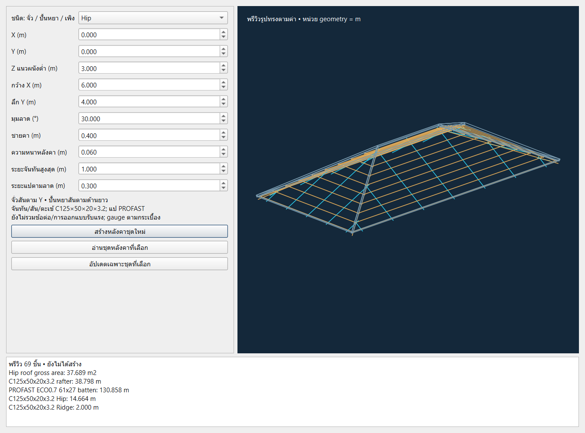

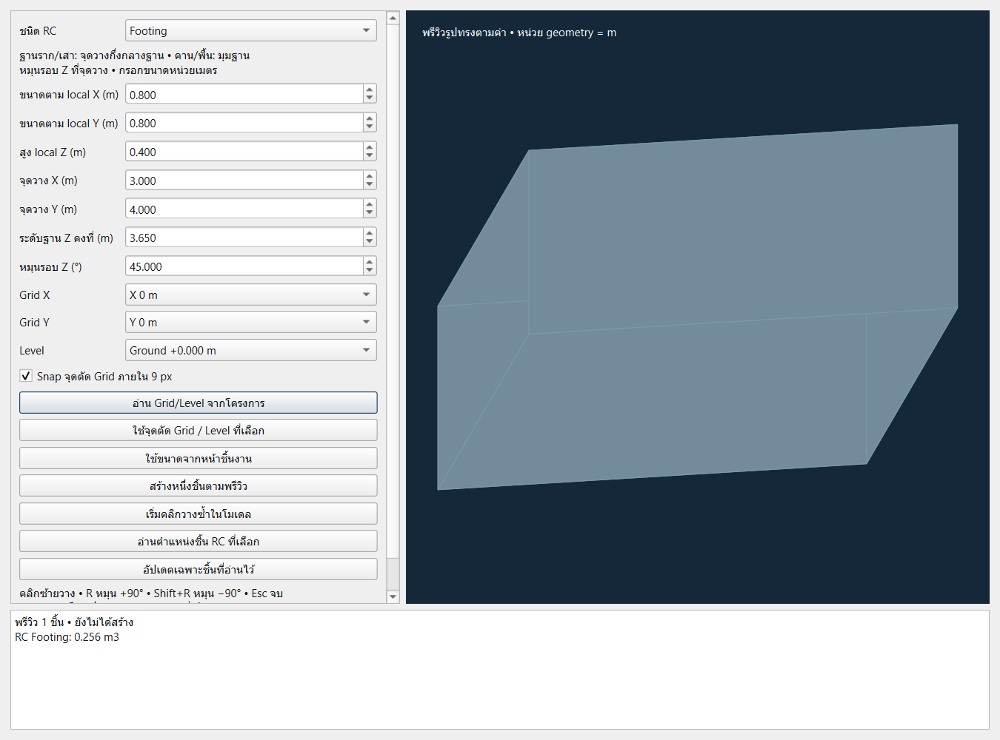

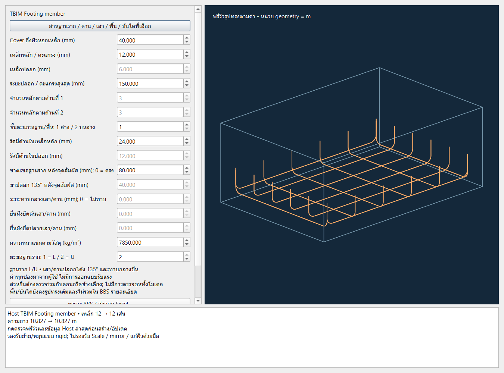

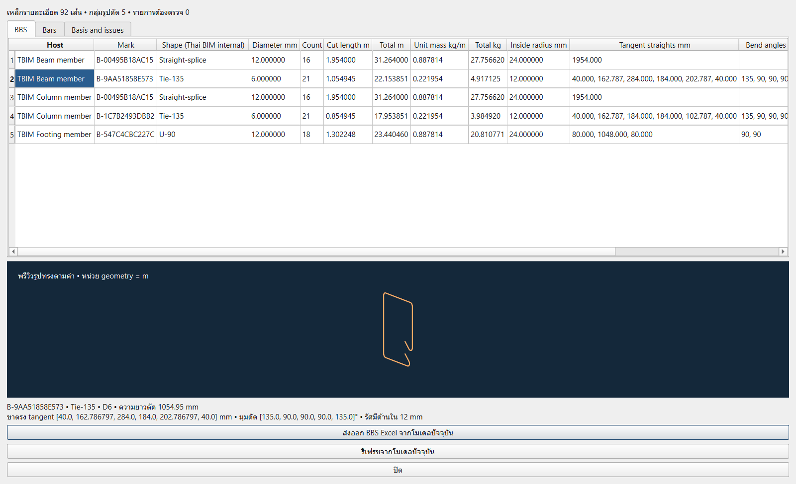

## Modeling limits

These tools model **user-specified dimensions**, not structural strength designs.
Default dimensions are editable examples, not engineered sizes.

- Footing L/U hooks, curved ties with two 135-degree tails, centre splices and straight anchorage extensions use explicit user input. Bend radius is measured at the inside face. These internal shape names are not standard shape codes or certified structural designs.
- BBS includes analytic arc lengths and nominal circular diameter mass at user-supplied density. Legacy, edited or independently transformed bars, and bars with changed/missing hosts are excluded. Rectangular slab and straight-stair bars now have detailed BBS. Legacy cages upgrade only after explicit host review and regeneration.
- Main laps are modeled as two parallel bars offset inward by 1.5 diameters. Nearby parallel main-bar collisions are rejected; whole-model clashes and adjacent concrete embedment are not checked.
- Concrete quantities are gross solids; intersections are not deducted.
- Legacy straight stairs retain their original geometry. New RC stairs support six layouts and landings; support interfaces, rails, headroom and strength require separate design.
- Roof sections are user presets. Connections, strength checks, tile-gauge
  verification, tile overlaps and accessories are not included.
- Concrete edits require explicit reinforcement review/regeneration. Rigid translation and rotation are supported; scale, shear, mirrors and manually edited host meshes remain blocked.
- New RC members use placement matrices so native Move/Rotate keeps their parametric meshes intact. Adopt old untouched members through the placement dialog before moving; old baked moves require host reconstruction.
- Placement UI supports upright members and Z rotation. Reinforcement review also accepts rigid tilted hosts. Placement always locks Z to the chosen base level, even when snapping named geometry points.
- Host notices inspect host geometry and bar poses. Individual bar-face edits are checked during review, regeneration, QTO and BBS.
- PDF/OCR, architecture/MEP generators, complete construction documents and LOD 350
  certification are outside this release.

See the Thai guide for axis conventions, cover definitions and all restrictions.
The example `.igz`, `.glb` and `.xlsx` files in [examples](examples/) were generated
in isolated test scenes; they are modeling examples, not construction designs.

## Verification

The installed 0.15.0 implementation passed **132 pure tests** and
**477 native checks** for solids, toolbar/dialog actions, stable updates, Undo,
host association, QTO invalidation, IGZ persistence and GLB export. Native checks
left the user's document geometry unchanged. Evidence is in
[RELEASE.json](RELEASE.json) and [evidence/live-checks.json](evidence/live-checks.json).

Run the portable tests from the repository root:

```sh
python -m pip install -r examples/extensions/thai_bim/tests/requirements.txt
python -m unittest discover -s examples/extensions/thai_bim/tests -p "test_*.py"
```

Current placement/review examples are `examples/placed-host-rebar.igz`, `examples/placed-host-rebar.glb` and `examples/placed-host-BBS.xlsx`. Older detailing/stair examples remain unchanged. Native test scripts for v0.4/v0.5 are historical and require their corresponding released plugin.

The native test script requires the plugin to be installed and enabled. Run it
in IngeTrazo's Python Console/AI bridge, where `scene` and `viewport` are supplied:

```python
import runpy
from core.extensions import user_plugins_dir
scope = runpy.run_path(
    str(user_plugins_dir() / 'thai_bim' / 'tests' / 'live_thai_bim_v13.py'),
    init_globals={'scene': scene, 'viewport': viewport},
)
scope = runpy.run_path(str(user_plugins_dir() / 'thai_bim' / 'tests' / 'live_types_v13.py'), init_globals=scope)
scope = runpy.run_path(str(user_plugins_dir() / 'thai_bim' / 'tests' / 'live_drawings_v13.py'), init_globals=scope)
scope = runpy.run_path(str(user_plugins_dir() / 'thai_bim' / 'tests' / 'live_copy_v101.py'), init_globals=scope)
scope = runpy.run_path(str(user_plugins_dir() / 'thai_bim' / 'tests' / 'live_recipes_v11.py'), init_globals=scope)
scope = runpy.run_path(str(user_plugins_dir() / 'thai_bim' / 'tests' / 'live_analytical_v13.py'), init_globals=scope)
runpy.run_path(str(user_plugins_dir() / 'thai_bim' / 'tests' / 'live_selected_edit_v13.py'), init_globals=scope)
```

Native tests temporarily open dialogs and write results into `verification-local/`
inside the installed plugin. They operate model-generation checks in isolated
scenes and verify that the active document remains unchanged.

## License and references

GPL-3.0-or-later; see [LICENSE](LICENSE). Icons and illustrations are drawn in Qt
by this extension. No third-party logos or API credentials are bundled.
The dialog/toolbar patterns were studied from IngeTrazo's Windowizer example
and the public [Stair Maker / Kitchen Maker examples](https://github.com/aashishzharbade-arch/ingetrazo-extensions).


## 0.7: layers and lighter reinforcement

New members use kind-specific structural layers; bars use host-kind layers.
The Layer / lightweight-model dialog migrates existing Thai BIM tags without replacing geometry, toggles visibility, converts one selected host cage, and saves a compressed native IGZ copy. Creation preserves existing members; selected updates cannot silently change kind. Stale prepared scene snapshots are rejected before replacing geometry.

New cages default to Lightweight (6-sided sections / 30-degree arc sampling).
Full uses 12 sides / 10-degree arcs. Centreline uses edges without solid faces;
use Full/Lightweight for surface-only exporters or renderers. All modes retain
analytic detailed cut lengths, masses and stable bar identities. Hiding bar layers
helps navigation; QTO/BBS still counts trusted hidden bars. Compression reduces
disk size, while display mode reduces mesh complexity in memory.

Independent main/tie selectors include TIS20-2559 RB/SR24, TIS24-2559 DB/SD30/40/50,
and ASTM A615/A615M numbered bars #3–#11, #14 and #18 in separate SI/inch sets.
Nominal dimensions come from published tables, including #9–#18 exceptions.
DB ribs are metadata rather than modeled geometry. Grade is a user specification;
no material certificate or strength design is generated. A706 presets are not included.
Old unclassified bars retain Custom/unspecified unless the user chooses a catalogue.
BBS adds specified catalogue, size, surface and grade columns; mass remains nominal
circular diameter times input density, not a rounded standard-mass lookup.

Verified 29-bar comparison: Full 15,526 faces / 21,088,108 bytes native IGZ;
Lightweight 3,256 faces / 4,678,153 bytes; Centreline 0 faces / 827,391 bytes.
Compressed copies were 756,288 / 152,456 / 32,752 bytes respectively.
All reopened in the installed host with valid BBS. This is a synthetic fixture,
not a whole-house navigation/FPS benchmark. Floor/stair paths remain net-path
QTO and are excluded from detailed fabrication BBS.

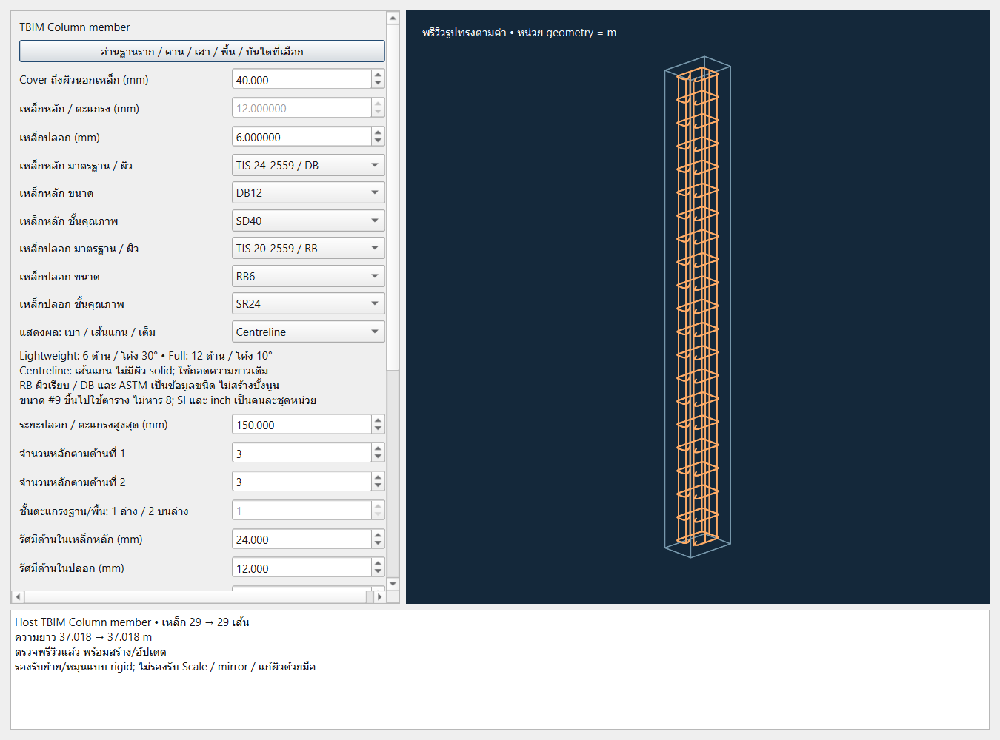
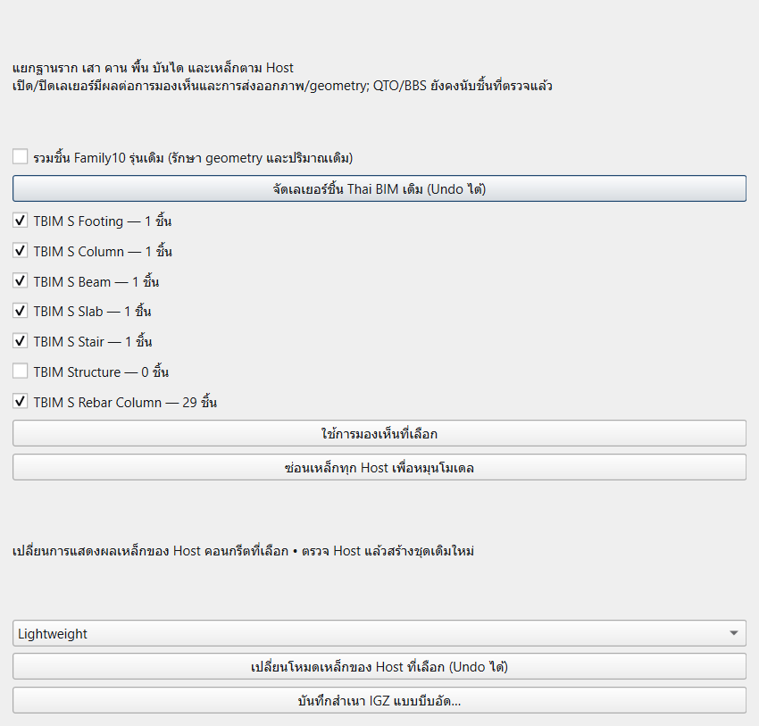

Sources: [TIS20](https://www.tisi.go.th/data/standard/fulltext/TIS-20-2559p.pdf),
[TIS24](https://www.tisi.go.th/data/standard/fulltext/TIS-24-2559p.pdf),
[NYSDOT dimensions](https://www.dot.ny.gov/divisions/engineering/technical-services/technical-services-repository/alme/pages/850-1b.html),
[CRSI nominal inch diameters](https://www.crsi.org/wp-content/uploads/CRSI_MSP_29th_Ed_Errata-Nov2019.pdf),
[ASTM scope](https://store.astm.org/a0615_a0615m-26.html).
See `evidence/performance-v07.json` and the current `RELEASE.json`.


## 0.7.1: complete-project review

Adds a read-only, four-tab project report with Excel export (overview, layers,
quantity summary and issues). The layer dialog can include legacy Family10
metadata, preserving geometry, IDs, hidden flags and quantity metadata; long
layer lists scroll. Original Family10 bars are explicitly excluded from detailed
fabrication BBS rather than silently appearing as zero. Their source quantity
metadata is retained in QTO. They are not adopted into toolkit regeneration.

Full saved Family10 R03 verification: 3,980 groups / 3,962 tagged elements,
17 footings and 3,178 legacy bars; 175,925 mesh faces. Migration/Undo and saved
IGZ reopening retained IDs and QTO. Original file SHA256 stayed unchanged.
The source was already compressed (8,679,685 bytes); the retagged copy was
8,702,136 bytes, so repeating compression provides no whole-project size saving.

Median synchronous rotating framebuffer readback across eight samples was
242.154 ms with reinforcement hidden and 722.703 ms visible. This includes event
processing and GPU readback, not interactive FPS. Source load took 21.70 s,
save 44.71 s and reopen 16.02 s on the test machine. Loading/saving remains costly.
See `evidence/family10-performance-v071.json`. The private house geometry and
QTO workbook are not included in the public extension package.

Historical 0.7.1 checks: 34 pure tests and 74 native checks, including 58 regression
checks, 14 whole-project checks and two audit/layer UI checks. Full-project
checks validate file/metadata preservation, not drawing completeness or LOD350.
At that release, detailed floor/stair BBS and construction sheets were future development stages.


## 0.8.0: slab and straight-stair detailing

Rectangular slab bars support one bottom mat or two top/bottom mats and optional
L/U 90-degree end hooks directed toward the slab midplane. Straight-stair bars
support vertical main-bar end legs with actual slope-dependent bend angles, or
straight extensions measured along the main-bar slope. Transverse distribution
bars are never extended with the main bars. Stair cover is checked normal to the
soffit, within the nominal waist thickness.

Hook input is the straight tail after the tangent point; radius input is the
inside radius. Impossible hooks are rejected before geometry changes. Stair
hooks and extensions are alternative detailing options. Slab/stair lap splices,
stair upper reinforcement, landings and L/U flights are not implemented.
Extensions require review against the adjacent landing/beam concrete.

Select the concrete host, read it in Reinforcement Host, set detailing, explicitly
review the preview, then create/update. Existing toolkit cages gain BBS only when
regenerated. Family10 legacy bars are not automatically adopted. The BBS row
preview now resolves the correct host despite the added steel catalogue columns.

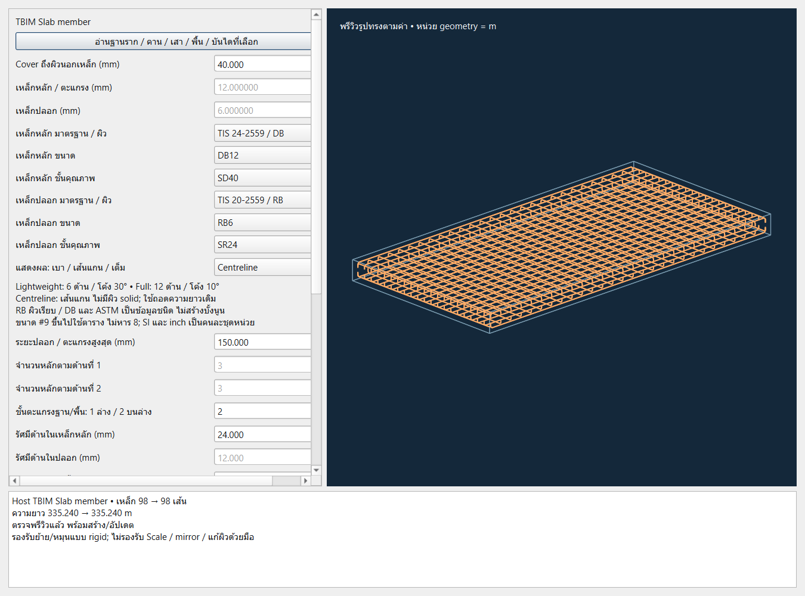
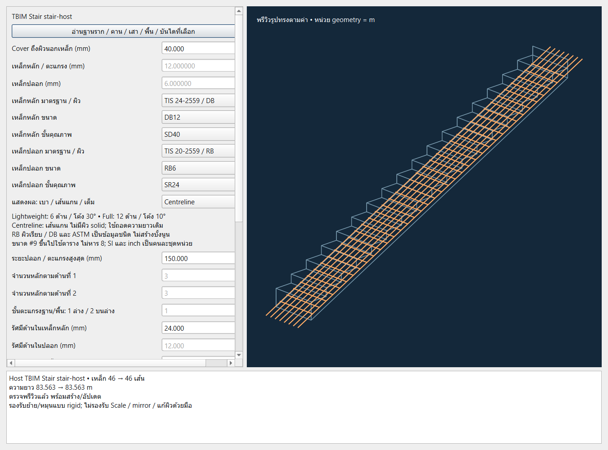
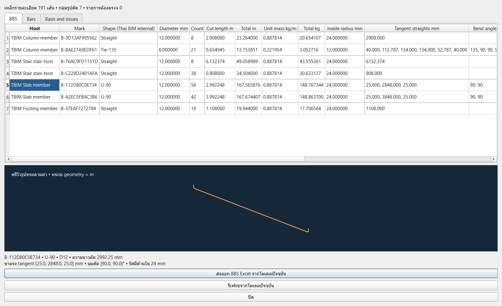

Synthetic examples: `examples/slab-stair-compact.igz` and
`examples/slab-stair-BBS.xlsx`. Historical 0.8.0 validation: 40 pure tests and 79 native
checks covering regressions, positive stair-hook solids, stable IDs and BBS across
display modes, exact Undo/Redo and native save/reopen. Whole-project Family10
evidence remains from 0.7.1 and was not rerun for 0.8.0. See `RELEASE.json` and
`evidence/live-checks.json`. Starter sheets at 1:50 were added in 0.9.0 below. User-supplied detailing is not structural design or LOD350 certification.


## 0.9.0: native starter sheets at 1:50

Use the **Sheet** toolbar button. Set explicit metre coordinates for grids and
levels, scope (selection or tagged BIM model), paper A3/A2/A1/A0 landscape,
plan cut Z, section X, datum, project title, author, revision and date. Review
the paper layout, then create/update and open Composer for the actual model
lines. The dialog preview represents paper layout only.

Five optional sheets: A101 floor plan, A102 roof plan, A201 front elevation,
A202 side elevation and A301 section A-A. Every frame is parallel at 1:50;
oversize scopes are rejected rather than silently rescaled. Title blocks and
scale bars are native editable sheet items. Grid and level anchors retain exact
user project coordinates instead of snapping to nearby model geometry.

Automatic dimensions measure grid intervals and selected model extents (which
can include roof overhangs). Add member/opening dimensions and construction
details manually in Composer. Orientations follow world axes; one plan cut and
one X section are supported, not floor-by-floor sets. Technical rendering is the
default. Vector hidden-line rendering is limited here to 5,000 source faces;
choose Technical or a smaller scope for larger models. Whole-project Family10
rendering performance was not benchmarked in this release.

Creation/update supports Undo/Redo and retains unrelated sheets. Source changes
block stale PDF export until explicit review/update. Manual sheet annotation
edits allow export but block regeneration; retain those edits in separate native
sheets before recreating the automatic set. Frame/view/section edits also block
export because grid placement may become stale. PDF export restores camera,
object/layer visibility and active section; it atomically replaces the output
only after successful rendering. Print at **100% actual size**, not fit-to-page.

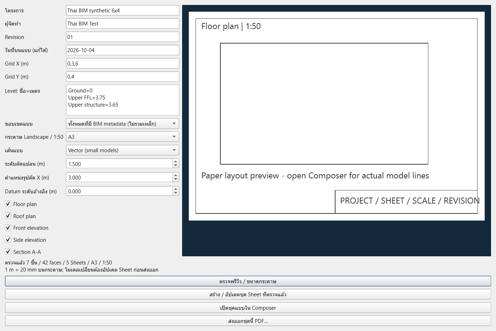
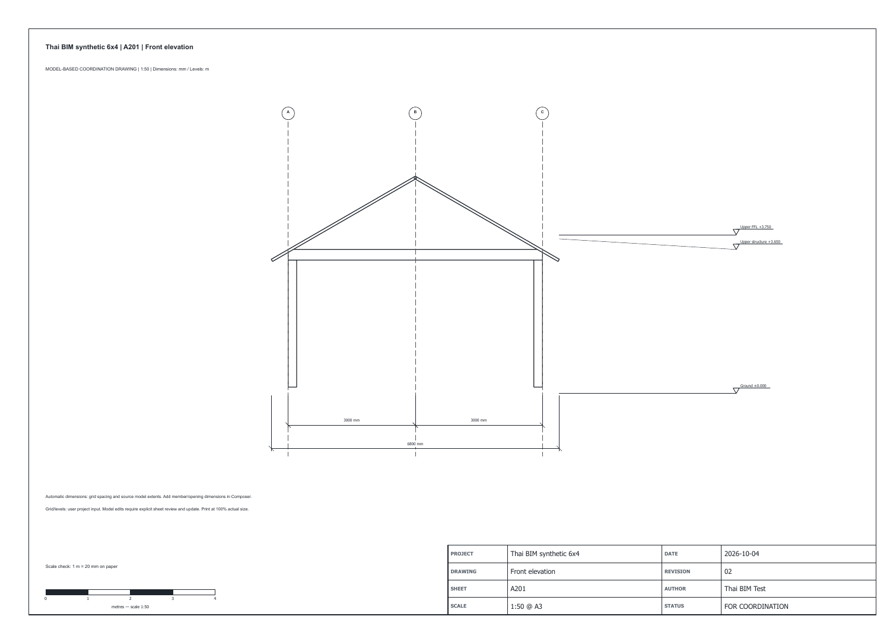

Historical 0.9.0 validation: 46 pure tests and 106 native checks (79 regression plus 27 drawing
checks), including native technical rendering, vector lines in all five PDF
frames, undo/redo, persistence, manual-edit preservation and updating after PDF
reprojection. Independent PDF checks measured grid dimension spans and scale
segments at exactly 20 mm per metre; all five rendered pages were inspected.
See [PDF evidence](evidence/pdf-qa.json). The synthetic examples are
`examples/drawing-set-1-50.igz` and `examples/Thai-BIM-drawings-1-50.pdf`.
These are model-based coordination starters, not complete construction
documents, strength design, standard conformity or LOD350 certification.


## 0.10.0: member types and point workflows

Two new toolbar buttons open **Member type library** and **Beam/slab/stair point
placement**. Choose a saved type or Custom, set the bottom Z and dimensions,
then start the viewport tool. This new workflow needs no project grid or level
entries; native geometry snaps supply XY while the explicitly entered Z remains
fixed. Wireframe previews follow the cursor. Each completed member is one Undo.

- Footing/column: repeated clicks at the bottom centre.
- Beam: start/end centreline points; horizontal span determines length, type
  determines section. No sloped beam support here.
- Slab: two opposite rectangle corners, or a simple polygon (including concave
  outlines) finished with Enter or a click near its first point. No holes.
- Straight stair: bottom/upper levels determine total rise, step count and going
  determine run. Click start then ascent direction; the second point does not
  stretch the flight. No landings or L/U flights.
- Backspace removes a path point; Esc clears an unfinished path, then exits on
  the next Esc. After completion another member may be placed immediately.

The project library offers add/edit/duplicate/delete and an illustrated preview,
type code/name/UUID/revision and dimension fields. It persists in IGZ with Undo.
JSON import replaces the project library with Undo; export/shared-library file
writes are explicit external file operations outside model Undo. A shared local
JSON library can be loaded into other projects. Types are detached snapshots on
instances: editing or removing a library row never changes existing geometry.
Applying a type affects exactly one selected compatible host, retains native and
business IDs and pose, and preserves beam length or slab outline. Instance
parameter overrides are recorded separately. Bulk type propagation is not
implemented. The older Grid placement tool is retained with its original grid
input requirements.

Existing explicit Host reinforcement review works on typed footing/column/beam,
rectangular slabs and directed straight stairs. The slab module now clips RC mats and mesh against actual polygon boundaries.
Legacy rectangle-only cages cannot substitute for polygon outlines.
Generic per-type reinforcement recipes remain available; new slab settings are per Host.
Changing a reinforced concrete host requires renewed reinforcement review.

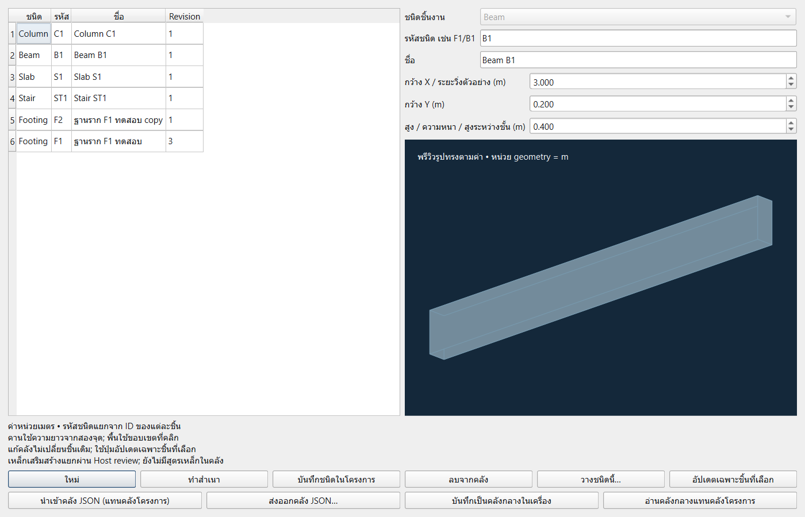
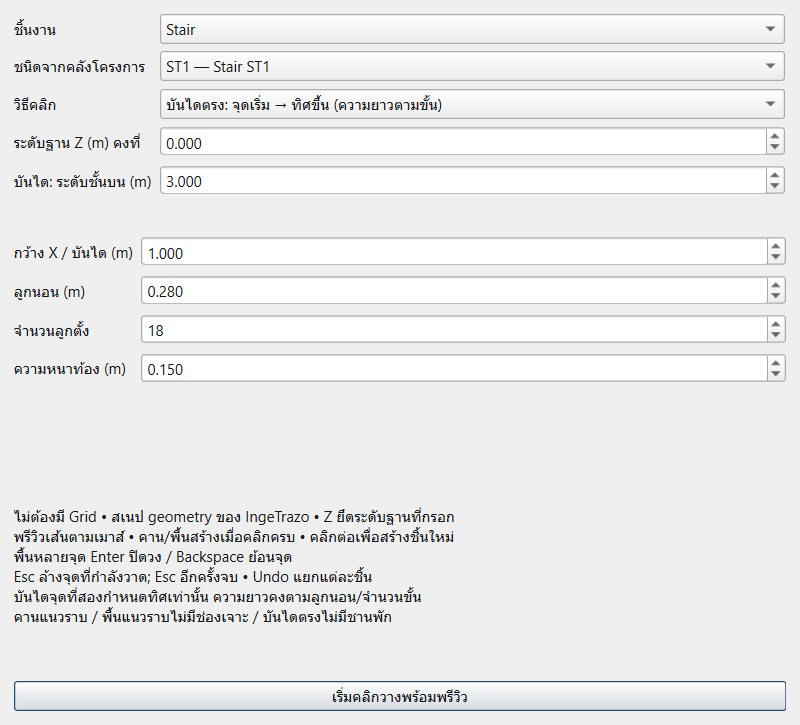
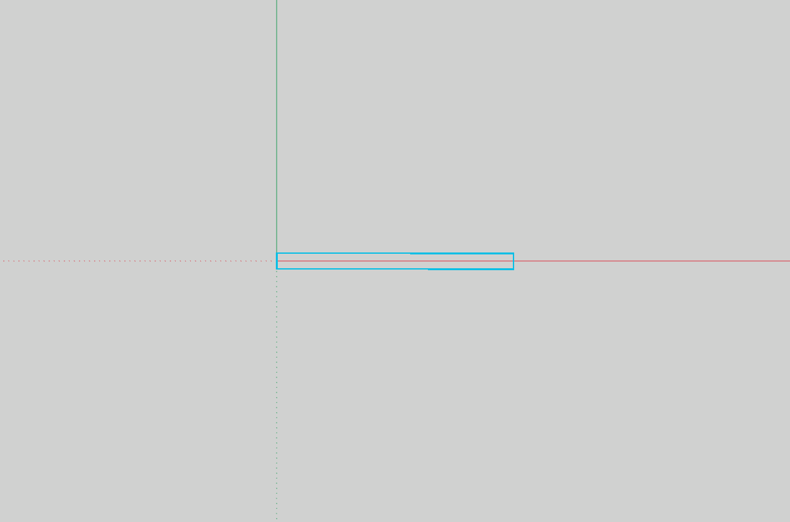

Historical 0.10.0 validation: 53 pure tests and 145 native checks (79 regression, 39 library/point
placement and 27 drawing checks). Actual Qt mouse/key events drive the viewport;
native framebuffer pixels verify visible preview. Tests include concave solid
volume, selected-instance edits, Thai JSON/IGZ roundtrips, per-member Undo/Redo,
project type snapshots, directed stair Host reinforcement and all five 1:50 PDF
pages. Synthetic examples: `examples/typed-members-click-placement.igz` and
`examples/member-types-ไทย.json`. Whole-project Family10 was not rerun.


## 0.13.0: native Copy followed by continued placement

Native Copy/Paste also copies extension metadata, including business IDs. New
independent additions now adopt those copies automatically instead of blocking
all placement. Original IDs are retained; duplicates/missing IDs get fresh IDs
and native instance bindings. Type IDs, native UIDs, pose, layers, shared meshes
and geometry remain untouched. Adoption and creation are one Undo/Redo step.
For selected edits, use **Adopt native copies / repair duplicate IDs** in the
structural workspace first, then reread the member.

Copied concrete is independent of the original's reinforcement. Copied bars and
multi-member assemblies are detached and marked for review; reinforcement hosts
are not inferred, and copied bars are excluded from verified QTO/BBS. Original
bar/host associations remain intact. Rebuild copied reinforcement through an
explicit concrete Host review; review/rebuild roof assemblies independently.

Validation: 59 pure tests and 161 native checks, with the full previous suite
rerun plus 16 native copy/adoption checks: shared component copy then placement,
copy-of-copy, exact Undo/Redo, selected-copy updates, preservation of original
BBS, copied-bar exclusion, stale metadata rejection and IGZ persistence.
Synthetic example: `examples/native-copies-adopted.igz`.


## 0.13.0: per-type reinforcement details

Open the member library, select a type and choose **แก้รายละเอียดเหล็ก / ดูพรีวิว…**.
Edit the existing illustrated Rebar form, accept the details using the persistent bottom button,
then save the member type. This changes the project library, with Undo; no bars are created.
Place that type or explicitly apply it to one selected concrete host. Read the host in Rebar,
review its actual geometry and then build. Existing cages retain their previous values until
you explicitly load the recipe attached to the host. Library edits never propagate to placed members.

Recipes include nominal RB/DB/ASTM selection and grade, cover, spacing, counts,
bend radii, hooks, lap/extension settings and display mode. Each generated bar records
the source type ID/revision, base recipe/hash and whether values were overridden.
JSON library export/import and native IGZ retain the recipes and provenance.
Old types without recipes remain supported. These are user-specified details, not strength design.
Polygon slab reinforcement remains unsupported; straight stair detailing remains one mat without lap.

Validation: 67 pure tests and 223 Windows native checks, including all 161 prior checks,
actual Qt accept-button events, all five host kinds, Undo/Redo, stale review protection,
ASTM inch precision, Unicode JSON, IGZ reopen and valid BBS. Synthetic isolated fixtures;
no new whole-Family10 performance benchmark or LOD350 certification.

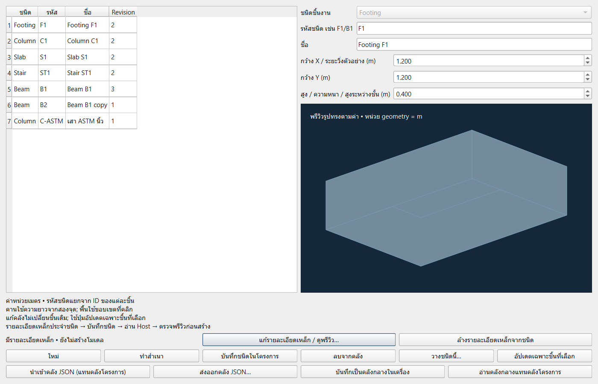
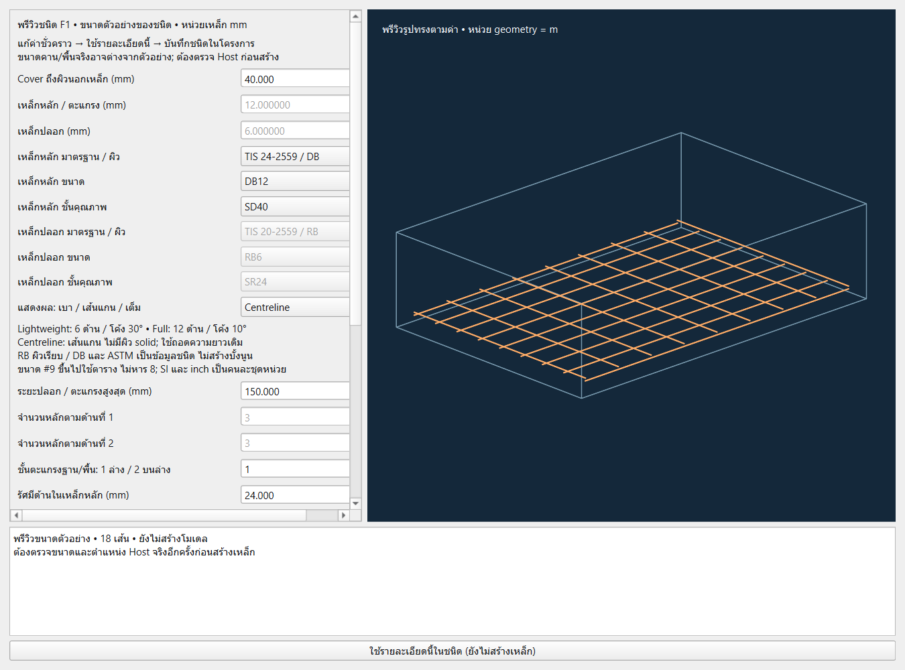


## 0.13.0: neutral analytical geometry snapshot

The twentieth toolbar button opens **Analytical Model / แนวแกนคาน–เสา**.
Generate the preview to display gold centroid axes and nodes over the physical model.
Select a diagnostic row to highlight its node/member. Save an undoable project snapshot
or export solver-neutral JSON. No additional physical geometry is created.
Exact endpoint-to-axis joints split analytical elements; near joints and interior crossings
remain separate and are reported. Source moves/edits invalidate saving the old snapshot.

The geometry contract lives at `scene.plugin_data['thai_bim_analytical']` and uses
model ID/revision, source business/native IDs and hashes, nodes, frame members/elements,
local axes and rectangular section properties. See [analytical contract](docs/analytical-contract.md).
This is not a solver: materials, supports, releases, offsets, loads and torsional stiffness
are unspecified. `solver_ready` is always false. Slabs/footings/stairs/walls/roofs are excluded.
Initial limit: 1000 source frame members; large-project performance is not benchmarked.

Current validation: 75 pure tests and 246 native checks (223 existing + 23 analytical),
including source guards, rigid conversion, internal joints, Undo/Redo, Unicode JSON,
native IGZ reopen, actual framebuffer overlay and diagnostic highlighting.

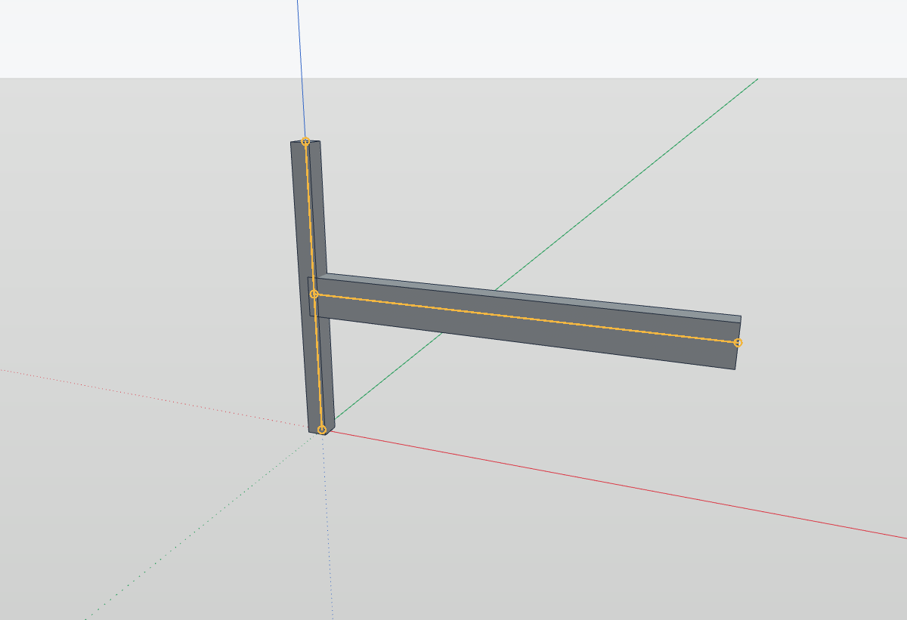
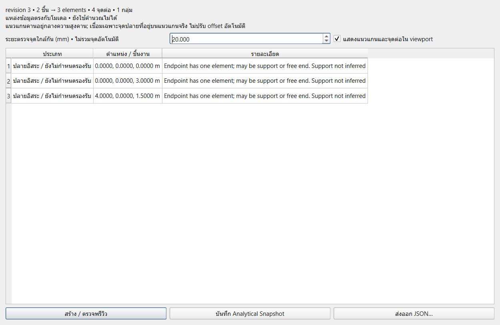


## 0.13.0: selected-instance dimension editor

Select one Thai BIM concrete member and use the twenty-first toolbar button,
**แก้ไขเฉพาะชิ้นที่เลือก / Instance dimensions**. Read its actual dimensions,
edit them, inspect the world-space preview and before/after volume, then save with Undo.
The project type library and sibling instances remain unchanged. Existing type snapshots,
identities, pose, name/layer/material/hidden state and assembly binding are preserved.

Footings/columns keep their centre and base; beams keep span, width centreline and bottom datum;
rectangular and polygon slabs keep their outline and base; straight stairs keep start/direction
while riser/going edits change the flight run. Endpoint/boundary dragging is not implemented.
Selection/document/host changes and duplicate native-copy IDs block stale updates.
Editing an adopted native copy creates a new mesh without changing the shared original.
Old bars remain for explicit Host review; the dialog provides a direct Rebar handoff.
Analytical snapshots become stale when their physical source geometry changes.

Validation: 81 pure tests and 298 native checks (246 existing + 52 instance editing),
including all five kinds, concave polygon outline, native save-button events, Undo/Redo,
selection/document/pose guards, existing bar retention, analytic staleness, shared native copy
and IGZ reopen. Polygon slab reinforcement and L/U stair modeling remain unsupported.

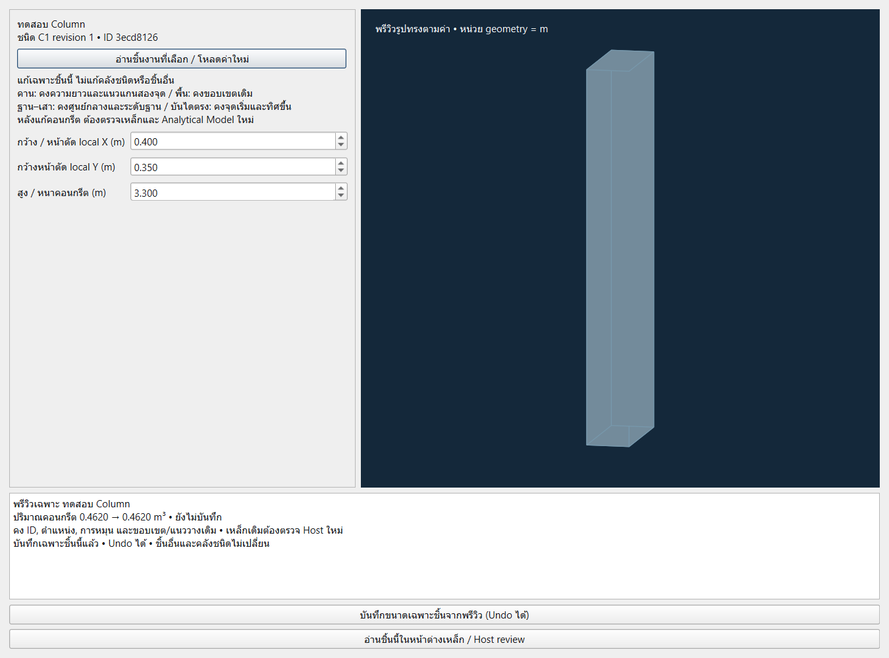


## 0.14.0: polygon slab mats, topping mesh and end dowels

Select one Thai BIM concrete Slab, then use the existing **Rebar Host** toolbar
icon or the new slab reinforcement button in the members tab. Read the Host,
select One-way / Two-way / Precast and local span X/Y, enter project detailing,
explicitly review, then create/update. Review and create buttons remain visible
at the bottom. Settings are saved per Host and reload from IGZ.

RC mode supports independent A/B bar sizes and maximum spacing, with Bottom or
Bottom + Top mats. Bars are clipped by exact boundary segment capsules,
including concave corners and negative local coordinates. Cover is to steel
surface. A/B bars touch on separate levels; insufficient thickness is rejected.
Precast mode places user-named welded mesh wires (2–12 mm) within topping at the
top of the existing full-thickness Host; it does not duplicate topping concrete.
Rectangular precast Hosts also support Start / End / Both straight or upward-L
dowels, with explicit embed, outside extension, diameter, spacing, cover and radius.

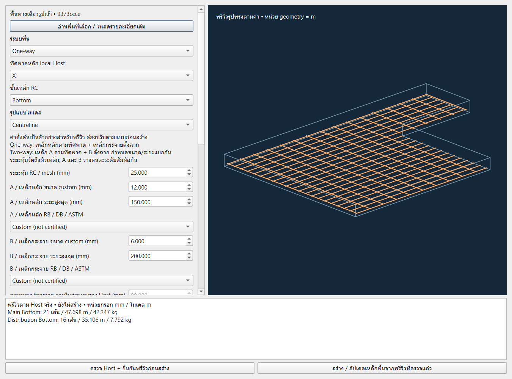
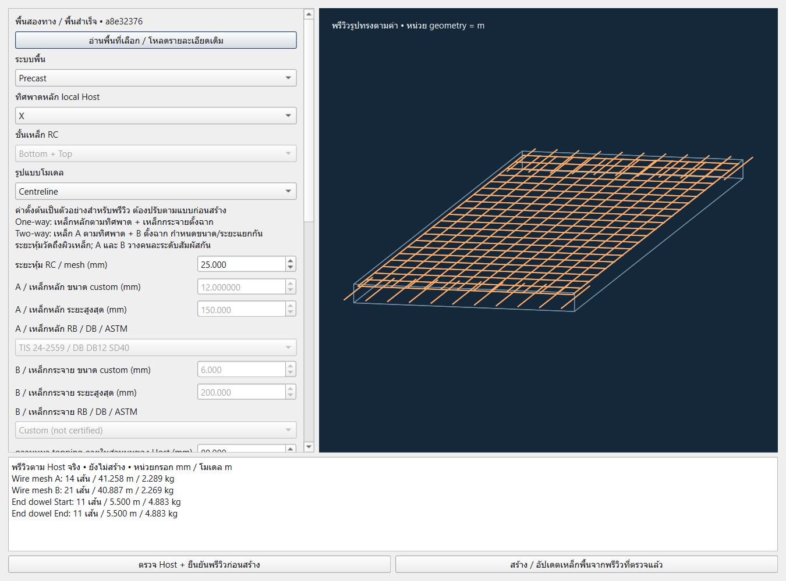

QTO and BBS distinguish main, distribution, two-way, mesh and end-dowel roles.
Excel adds slab system, role and mesh product text. Mesh quantities are net wire
length and mass, excluding sheet/roll procurement counts, laps and waste.
Centreline is the default; Full and Lightweight retain the same analytic BBS.
Updates replace only the reviewed Host cage, retain matching IDs and support Undo.
Selection/document/Host/type/settings changes invalidate review; copied IDs and
manually edited or independently moved bars must be resolved before updating.

No slab openings, support-strength/anchorage design, top support strips, mat
hooks/laps, automatic support recognition, physical precast plank subdivision or
prestressing are implemented. System names are explicit user choices, not an
automatic structural classification. New slab recipes are per Host; integration
with the type catalogue remains pending.

Validation: 105 pure tests and 343 native checks (298 regression + 45 slab checks),
including native Qt create, polygon clipping, mode conversion, steel catalogues,
role-separated Excel, Full/Lightweight geometry, Unicode IGZ, stale review and
Undo/Redo. Synthetic examples only; user document geometry remains unchanged.


## 0.15.0: six RC stair forms, landings and explicit connection patterns

The existing Stair toolbar button opens an illustrated modeless dialog. Choose
Straight, L, U, Spiral, Circular or Floating, hand, XYZ and yaw. L/U include an
intermediate landing; U requires equal flight riser counts. Optional start/end
landings are tangent rectangles on curved stairs. Floating creates separate RC
treads without landings or a supporting wall/spine. New stairs include a complete
final tread at the upper datum; the separate legacy straight tool keeps its
original upper-floor-as-final-step convention.

Create concrete, read the selected Host, set reinforcement, review Host+bars,
then explicitly create/update the reviewed cage. Dimensions and bar settings are
per Host. Nested closed flight/landing parts keep the parent identity and layer;
QTO sums gross part volumes without intersection deductions. BBS records stair
layout, bar role and length basis. Edited concrete invalidates old cage quantities
until renewed review and regeneration. Copy adoption produces independent cages.

Straight/L/U main bars use rounded cranks into available landings with user-set
extension and transverse bars. Landing mats use the slab geometry engine.
Spiral/Circular main bars use analytic helix length; radial bars and landing mats
are separate. Floating has top cantilever bars with explicit outside embedment
and bottom distribution bars. All support the existing RB/DB/ASTM catalogue and
Centreline, Lightweight or Full representation.

The additional connection table accepts straight/L patterns with name, XYZ,
angle, length, signed vertical leg, count and spacing. Units are metres except
angle in degrees; coordinates are Host-local Left coordinates before Right-hand
reflection. These are designer-specified patterns, without adjacent-host,
anchorage, strength, headroom or whole-building clash validation. L/U main bars
are separate flights extending into landings, not one continuous 3D bent bar.
Supports, centre columns and railings are not generated. Advanced stairs are not
yet integrated into the legacy type catalogue. Structural steel generation is
not implemented; material_system only reserves a future schema boundary.

BBS validates each Host fingerprint once per export rather than once per bar.
This cache is local to that export; changed nested geometry is detected on the
next export. 132 pure tests and 477 native checks passed, including all forms,
native closed solids, Qt actions, Undo/Redo, copy identity, stale-source guards,
Excel, GLB and IGZ save/reopen. Synthetic fixtures are not construction designs.

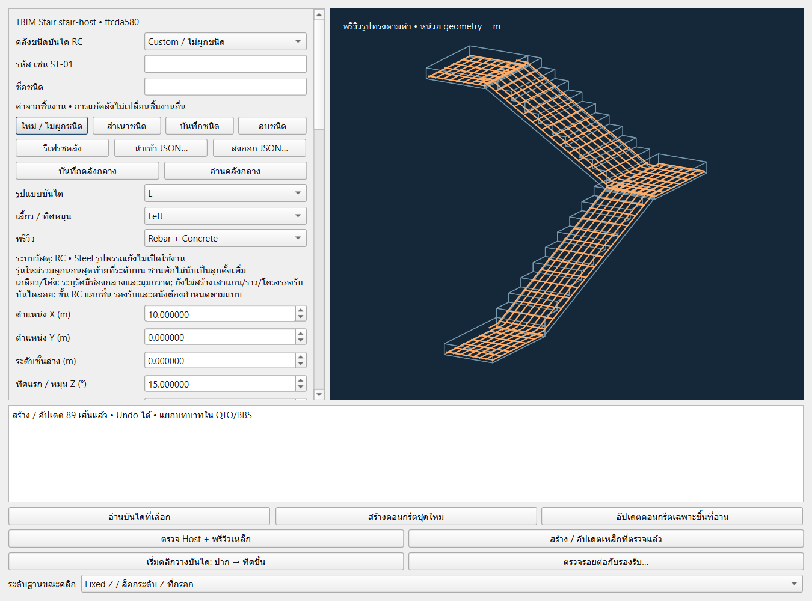
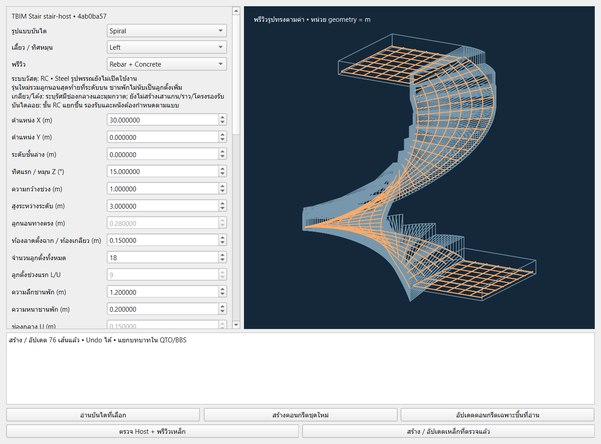
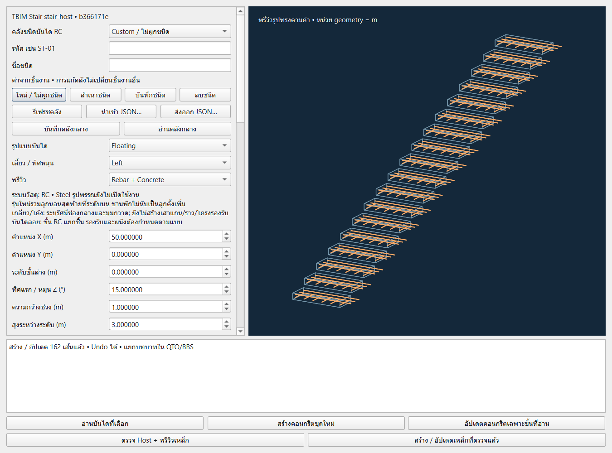
